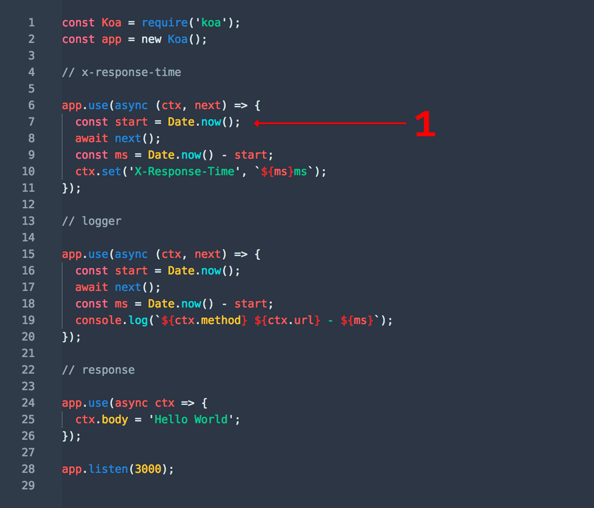

# From Koa to Oak

`Koa` is a web development framework for `Node.js`, created by the original developers of `Express`. It aims to be a smaller, more expressive, and robust web framework. Unlike `Express`, `Koa` doesn't bind any middleware in its core methods; instead, it provides a lightweight and elegant function library, making it easy to write web applications.

## Koa

### Differences from Express

Let's briefly discuss the main differences between `Koa` and `Express`:

- `Express` encapsulates and includes many middlewares, such as `connect` and `router`. In contrast, `Koa` is more lightweight, allowing developers to customize the framework based on their needs.
- `Express` processes middleware based on callbacks, while `Koa` uses async/await.
- In the asynchronous execution of middleware, `Express` doesn't strictly follow the **onion model**, whereas `Koa` strictly adheres to it (this is evident when dealing with asynchronous functions in middleware).

Now, let's introduce the onion model.

#### Onion Model

The onion is known for its layered structure, where each layer wraps around the next. However, in this context, we don't focus on its three-dimensional structure but rather imagine cutting the onion and looking at it from a flat perspective, as shown in the following diagram:


To traverse from the center of the onion, one must first pass through the onion layers to reach the center and then traverse back out through the layers to the surface. The interesting part is that the number of layers penetrated inward must match the number of layers traversed outward. This concept aligns with the **stack list** principle, following the **last in, first out** rule.

Whether it's `Express` or `Koa`, both are built on the concept of middleware. Middleware is primarily used for intercepting requests and modifying request or response results. The execution of middleware depends on the onion model.

The onion's layers can be likened to middleware:

:::info 
The process from the outer layer to the inner layer is a critical keyword: `next()`. If `next()` is not called, the next middleware won't be executed. 

Conversely, going from the inner layer to the outer layer involves each middleware completing its execution, entering the original higher layer middleware, and continuing until the outermost layer.
:::

In other words, for asynchronous middleware, `Koa` and `Express` may have differences in the execution order of code under certain circumstances.

#### Asynchronous Differences

Let's examine the same logic, starting with `Express`:

```javascript
const express = require("express");
const app = express();

app.use(async (req, res, next) => {
  const start = Date.now();
  console.log(1);
  await next();
  console.log(2);
});
app.use(async (req, res, next) => {
  console.log("3");
  await next();
  await new Promise(
    (resolve) =>
      setTimeout(
        () => {
          console.log(`wait 1000 ms end`);
          resolve();
        },
        1000,
      ),
  );
  console.log("4");
});

app.use((req, res, next) => {
  console.log(5);
  res.send("hello express");
});

app.listen(3001);
console.log("server listening at port 3001");
```

Normally, we expect the order of the returned results to be:

```javascript
1
3
5
wait 1000 ms end
4
2
```

However, the actual result is:

```javascript
1
3
5
2
wait 1000 ms end
4
```

The equivalent logic in Koa code is as follows:

```javascript
const Koa = require("koa");
const app = new Koa();

app.use(async (ctx, next) => {
  console.log(1);
  await next();
  console.log(2);
});

app.use(async (ctx, next) => {
  console.log(3);
  await next();
  await new Promise(
    (resolve) =>
      setTimeout(
        () => {
          console.log(`wait 1000 ms end`);
          resolve();
        },
        1000,
      ),
  );
  console.log(4);
});

// response
app.use(async (ctx) => {
  console.log(5);
  ctx.body = "Hello Koa";
});

app.listen(3000);
console.log("app start : http://localhost:3000");
```

#### Response Differences

In most cases, the response handling in `koa` and `Express` is not significantly different. The main distinction lies in the syntax; for instance, `koa` uses `ctx.body = xxx`, while `Express` employs methods like `res.send` or `res.json`.

However, there are situations where `Express` falls short, as illustrated in the following example:

```javascript
const Koa = require("koa");
const app = new Koa();

// x-response-time
app.use(async (ctx, next) => {
  const start = Date.now();
  await next();
  const ms = Date.now() - start;
  ctx.set("X-Response-Time", `${ms}ms`);
});

// response
app.use(async (ctx) => {
  ctx.body = "Hello Koa";
});

app.listen(3000);
console.log("app start: http://localhost:3000");
```

The code above aims to add a response header to all endpoints, representing the execution time of the respective endpoint function.

In Express, you might handle this scenario as follows:

```javascript
const express = require("express");
const app = express();

app.use(async (req, res, next) => {
  const start = Date.now();
  await next();
  const ms = Date.now() - start;
  res.header("X-Response-Time", `${ms}ms`);
});

app.use((req, res, next) => {
  res.send("hello express");
});

app.listen(3001);
console.log("server listening at port 3001");
```

However, an error occurs during the request:

```bash
Error [ERR_HTTP_HEADERS_SENT]: Cannot set headers after they are sent to the client
```

This error arises because `res.send` implies that the response has already been sent. Attempting to set headers after this point is not permitted.

In other words, when using methods like `res.send` in Express, the response is sent immediately. In contrast, Koa waits for all middleware to complete before sending the response.

### Main Logic of Middleware Processing

The middleware processing logic in Koa is straightforward and primarily relies on [koa-compose](https://github.com/koajs/compose):

```javascript
function compose(middleware) {
  if (!Array.isArray(middleware)) {
    throw new TypeError("Middleware stack must be an array!");
  }
  for (const fn of middleware) {
    if (typeof fn !== "function") {
      throw new TypeError("Middleware must be composed of functions!");
    }
  }

  /**
   * @param {Object} context
   * @return {Promise}
   * @api public
   */
  return function (context, next) {
    // last called middleware #
    let index = -1;
    return dispatch(0);
    function dispatch(i) {
      if (i <= index) {
        return Promise.reject(new Error("next() called multiple times"));
      }
      index = i;
      let fn = middleware[i];
      if (i === middleware.length) fn = next;
      if (!fn) return Promise.resolve();
      try {
        return Promise.resolve(fn(context, dispatch.bind(null, i + 1)));
      } catch (err) {
        return Promise.reject(err);
      }
    }
  };
}
```

### Middleware Invocation

The `next()` function called in each middleware is essentially equivalent to this:

```javascript
dispatch.bind(null, i + 1);
```

Leveraging the properties of closures and recursion, the middlewares are executed one by one, and each execution returns a promise.

Let's outline the execution flow of middlewares in Koa:



## oak

As a counterpart to the Koa framework in Node.js, developers have created an "oak" framework for Deno, with usage almost identical. The learning curve is minimal, making it highly recommended.

Here's an example code:

```typescript
import { Application } from "https://deno.land/x/oak/mod.ts";

const app = new Application();

app.use(async (ctx, next) => {
  const start = Date.now();
  console.log(1);
  await next();
  console.log(2);
  const ms = Date.now() - start;
  ctx.response.headers.set("X-Response-Time", `${ms}ms`);
});

app.use(async (ctx, next) => {
  const start = Date.now();
  console.log(3);
  await next();
  await new Promise(
    (resolve) =>
      setTimeout(
        () => {
          console.log(`wait 1000 ms end`);
          resolve("wait");
        },
        1000,
      ),
  );
  console.log(4);
  const ms = Date.now() - start;
  console.log(`${ctx.request.method} ${ctx.request.url} - ${ms}`);
});

app.use((ctx) => {
  console.log(5);
  ctx.response.body = "Hello Deno!";
});

console.log("app start : http://localhost:3002");
await app.listen({ port: 3002 });
```

### Middleware Handling Logic

Its middleware handling logic can be found at [https://deno.land/x/oak@v9.0.0/middleware.ts](https://deno.land/x/oak@v9.0.0/middleware.ts):

```typescript
/** Compose multiple middleware functions into a single middleware function. */
export function compose<
  S extends State = Record<string, any>,
  T extends Context = Context<S>,
>(
  middleware: Middleware<S, T>[],
): (context: T, next?: () => Promise<unknown>) => Promise<unknown> {
  return function composedMiddleware(
    context: T,
    next?: () => Promise<unknown>,
  ): Promise<unknown> {
    let index = -1;

    async function dispatch(i: number): Promise<void> {
      if (i <= index) {
        throw new Error("next() called multiple times.");
      }
      index = i;
      let fn: Middleware<S, T> | undefined = middleware[i];
      if (i === middleware.length) {
        fn = next;
      }
      if (!fn) {
        return;
      }
      await fn(context, dispatch.bind(null, i + 1));
    }

    return dispatch(0);
  };
}
```

It's evident that it's almost identical to Koa.

### Simplified Oak

Now, let's create a simplified version of Oak/Koa to achieve the functionality mentioned above.

Before implementing it, let's take a look at the HTTP server code in Deno:

```typescript
// Start listening on port 8080 of localhost.
const server = Deno.listen({ port: 8080 });
console.log(`HTTP webserver running.  Access it at:  http://localhost:8080/`);

// Connections to the server will be yielded up as an async iterable.
for await (const conn of server) {
  // In order to not be blocking, we need to handle each connection individually
  // without awaiting the function
  serveHttp(conn);
}

async function serveHttp(conn: Deno.Conn) {
  // This "upgrades" a network connection into an HTTP connection.
  const httpConn = Deno.serveHttp(conn);
  // Each request sent over the HTTP connection will be yielded as an async
  // iterator from the HTTP connection.
  for await (const requestEvent of httpConn) {
    // The native HTTP server uses the web standard `Request` and `Response`
    // objects.
    const body = `Your user-agent is:\n\n${
      requestEvent.request.headers.get(
        "user-agent",
      ) ?? "Unknown"
    }`;

    // The requestEvent's .respondWith() method is how we send the response back to the client.
    requestEvent.respondWith(
      new Response(body, {
        status: 200,
      }),
    );
  }
}
```

By using the above code, you can start a service at `http://localhost:8080`.

So, our code is also straightforward:

```typescript
class Application {
  middlewares: Middleware[] = [];

  use(callback: Middleware) {
    this.middlewares.push(callback);
  }

  async listen(config: {
    port: number;
  }) {
    const middlewares = this.middlewares;
    const server = Deno.listen(config);
    console.log(
      `HTTP webserver running.  Access it at:  http://localhost:${config.port}/`,
    );

    // Connections to the server will be yielded up as an async iterable.
    for await (const conn of server) {
      // In order to not be blocking, we need to handle each connection individually
      // without awaiting the function
      serveHttp(conn);
    }

    async function serveHttp(conn: Deno.Conn) {
      // This "upgrades" a network connection into an HTTP connection.
      const httpConn = Deno.serveHttp(conn);
      // Each request sent over the HTTP connection will be yielded as an async
      // iterator from the HTTP connection.
      for await (const requestEvent of httpConn) {
        const ctx: Context = {
          request: requestEvent.request,
          response: {
            body: "",
            status: 200,
            headers: {
              _headers: {},
              set(key: string, value: string | number) {
                (this._headers as any)[key] = value;
              },
              get(key: string) {
                return (this._headers as any)[key];
              },
            },
          },
        };
        console.log(requestEvent.request.url);
        await compose(middlewares)(ctx);
        const body = ctx.response.body;
        requestEvent.respondWith(
          new Response(body, {
            status: ctx.response.status,
            headers: ctx.response.headers._headers,
          }),
        );
      }
    }
  }
}
```

This way, a simple functionality using middleware to handle messages has been implemented. As for how to implement routing, that's left to everyone.

## Conclusion

This article has discussed the differences between two mainstream web frameworks in Node.js, Koa and Express, and explained the middleware handling logic in Koa. It is evident that Koa's design philosophy is quite ingenious. This discussion leads to the introduction of Oak, a framework similar to Koa, in the context of Deno. The goal is to provide a brief understanding of Deno by comparing the usage differences between the two.

---

References for this article:

- [Talking About the 'Onion Model' in Node.js Frameworks](https://blog.csdn.net/qq_43293207/article/details/116331223)
- [Never Fear the Interviewer Asking About the Differences Between Express and Koa Again](https://zhuanlan.zhihu.com/p/87079561)
