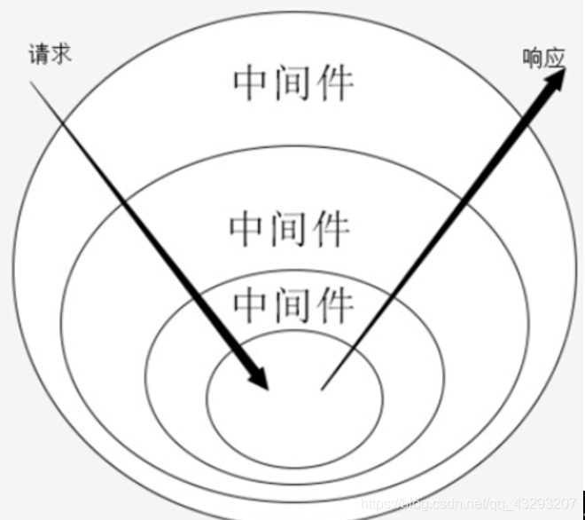

# 从koa到oak

`koa`是`Node.js`的一个web开发框架，它是由`Express`原班人马打造的，致力于成为一个更小、更富有表现力、更健壮的
`Web`框架。`koa`不在内核方法中绑定任何中间件，它仅仅提供了一个轻量优雅的函数库，使得编写
Web 应用变得得心应手。

## koa

### 与Express区别

这里简单讲下`koa`与`Express`的主要区别：

- Express 封装、内置了很多中间件，比如 connect 和 router ，而 koa
  则比较轻量，开发者可以根据自身需求订制框架；
- Express 是基于 callback 来处理中间件的，而 koa 则是基于async/await；
- 在异步执行中间件时，Express 并非严格按照**洋葱模型**执行中间件，而 koa
  则是严格遵循的（体现在二者在中间件为异步函数的时候处理会有不同）。

所以，需要先介绍下洋葱模型。

#### 洋葱模型

洋葱我们都知道，一层包裹着一层，层层递进，但是现在不是看其立体的结构，而是需要将洋葱切开来，从切开的平面来看，如图所示：



可以看到，要从洋葱中心点穿过去，就必须先一层层向内穿入洋葱表皮进入中心点，然后再从中心点一层层向外穿出表皮。
这里有个特点：进入时穿入了多少层表皮，出去时就必须穿出多少层表皮。先穿入表皮，后穿出表皮，符合我们所说的**栈列表**，**先进后出**的原则。

无论是Express还是koa，都是基于中间件来实现的。中间件主要用于请求拦截和修改请求或响应结果的。而中间件（可以理解为一个类或者函数模块）的执行方式就需要依据洋葱模型。

洋葱的表皮我们可以思考为中间件：

:::info 从外向内的过程是一个关键词
next()；如果没有调用next()，则不会调用下一个中间件；
而从内向外则是每个中间件执行完毕后，进入原来的上一层中间件，一直到最外一层。 :::

也就是说，对于异步中间件，koa与Express在某种情况代码的执行顺序会有差异。

#### 异步差异

同样的逻辑，先来Express：

```javascript
const express = require("express");
const app = express();

app.use(async (req, res, next) => {
  const start = Date.now();
  console.log(1);
  await next();
  console.log(2);
});
app.use(async (req, res, next) => {
  console.log("3");
  await next();
  await new Promise(
    (resolve) =>
      setTimeout(
        () => {
          console.log(`wait 1000 ms end`);
          resolve();
        },
        1000,
      ),
  );
  console.log("4");
});

app.use((req, res, next) => {
  console.log(5);
  res.send("hello express");
});

app.listen(3001);
console.log("server listening at port 3001");
```

正常而言，我们期望返回结果顺序是：

```javascript
1
3
5
wait 1000 ms end
4
2
```

但事实上结果是：

```javascript
1
3
5
2
wait 1000 ms end
4
```

同样逻辑的Koa代码：

```javascript
const Koa = require("koa");
const app = new Koa();

app.use(async (ctx, next) => {
  console.log(1);
  await next();
  console.log(2);
});

app.use(async (ctx, next) => {
  console.log(3);
  await next();
  await new Promise(
    (resolve) =>
      setTimeout(
        () => {
          console.log(`wait 1000 ms end`);
          resolve();
        },
        1000,
      ),
  );
  console.log(4);
});

// response
app.use(async (ctx) => {
  console.log(5);
  ctx.body = "Hello Koa";
});

app.listen(3000);
console.log("app start : http://localhost:3000");
```

#### 响应差异

大部分情况下，`koa`与`Express`的响应是没有区别的，只是写法稍有不同，前者需要`ctx.body = xxx`，而后者需要用`res.send`或`res.json`等方法。

但以下这种情况，就是`Express`不能做到的。

```javascript
const Koa = require("koa");
const app = new Koa();

// x-response-time
app.use(async (ctx, next) => {
  const start = Date.now();
  await next();
  const ms = Date.now() - start;
  ctx.set("X-Response-Time", `${ms}ms`);
});

// response
app.use(async (ctx) => {
  ctx.body = "Hello Koa";
});

app.listen(3000);
console.log("app start : http://localhost:3000");
```

上述代码主要是想给所有的接口添加一个响应头，这个响应头代表着这个接口函数的执行时间。

在Express中，你可能会这样写：

```javascript
const express = require("express");
const app = express();

app.use(async (req, res, next) => {
  const start = Date.now();
  await next();
  const ms = Date.now() - start;
  res.header("X-Response-Time", `${ms}ms`);
});

app.use((req, res, next) => {
  res.send("hello express");
});

app.listen(3001);
console.log("server listening at port 3001");
```

但请求时会报错：

```javascript
Error [ERR_HTTP_HEADERS_SENT]: Cannot set headers after they are sent to the client
```

因为res.send已经意味着发送响应了，这时你还想再设置响应头，是不允许的。

也就是说，Express使用res.send等方法，会直接进行响应，而koa会等所有中间件都完成后，才会响应。

### 中间件主要处理逻辑

koa的中间件处理逻辑非常简单，主要放在[koa-compose](https://github.com/koajs/compose)中：

```javascript
function compose(middleware) {
  if (!Array.isArray(middleware)) {
    throw new TypeError("Middleware stack must be an array!");
  }
  for (const fn of middleware) {
    if (typeof fn !== "function") {
      throw new TypeError("Middleware must be composed of functions!");
    }
  }

  /**
   * @param {Object} context
   * @return {Promise}
   * @api public
   */
  return function (context, next) {
    // last called middleware #
    let index = -1;
    return dispatch(0);
    function dispatch(i) {
      if (i <= index) {
        return Promise.reject(new Error("next() called multiple times"));
      }
      index = i;
      let fn = middleware[i];
      if (i === middleware.length) fn = next;
      if (!fn) return Promise.resolve();
      try {
        return Promise.resolve(fn(context, dispatch.bind(null, i + 1)));
      } catch (err) {
        return Promise.reject(err);
      }
    }
  };
}
```

每个中间件调用的next()其实就是这个：

```javascript
dispatch.bind(null, i + 1);
```

还是利用闭包和递归的性质，一个个执行，并且每次执行都是返回promise。

再贴出koa中间件的执行流程吧：


## oak

对标Node.js的koa框架，Deno有开发者参考它开发出一个oak框架，用法几乎一模一样，学习成本很低，推荐使用。

代码如下：

```typescript
import { Application } from "https://deno.land/x/oak/mod.ts";

const app = new Application();

app.use(async (ctx, next) => {
  const start = Date.now();
  console.log(1);
  await next();
  console.log(2);
  const ms = Date.now() - start;
  ctx.response.headers.set("X-Response-Time", `${ms}ms`);
});

app.use(async (ctx, next) => {
  const start = Date.now();
  console.log(3);
  await next();
  await new Promise(
    (resolve) =>
      setTimeout(
        () => {
          console.log(`wait 1000 ms end`);
          resolve("wait");
        },
        1000,
      ),
  );
  console.log(4);
  const ms = Date.now() - start;
  console.log(`${ctx.request.method} ${ctx.request.url} - ${ms}`);
});

app.use((ctx) => {
  console.log(5);
  ctx.response.body = "Hello Deno!";
});

console.log("app start : http://localhost:3002");
await app.listen({ port: 3002 });
```

### 中间件处理逻辑

它的中间件处理逻辑在[https://deno.land/x/oak@v9.0.0/middleware.ts](https://deno.land/x/oak@v9.0.0/middleware.ts)：

```typescript
/** Compose multiple middleware functions into a single middleware function. */
export function compose<
  S extends State = Record<string, any>,
  T extends Context = Context<S>,
>(
  middleware: Middleware<S, T>[],
): (context: T, next?: () => Promise<unknown>) => Promise<unknown> {
  return function composedMiddleware(
    context: T,
    next?: () => Promise<unknown>,
  ): Promise<unknown> {
    let index = -1;

    async function dispatch(i: number): Promise<void> {
      if (i <= index) {
        throw new Error("next() called multiple times.");
      }
      index = i;
      let fn: Middleware<S, T> | undefined = middleware[i];
      if (i === middleware.length) {
        fn = next;
      }
      if (!fn) {
        return;
      }
      await fn(context, dispatch.bind(null, i + 1));
    }

    return dispatch(0);
  };
}
```

看的出来与koa的几乎一模一样。

### 简版oak

下面，我们写个简版的oak/koa，实现上述的样例功能。

实现前，先看下Deno的HTTP服务代码：

```typescript
// Start listening on port 8080 of localhost.
const server = Deno.listen({ port: 8080 });
console.log(`HTTP webserver running.  Access it at:  http://localhost:8080/`);

// Connections to the server will be yielded up as an async iterable.
for await (const conn of server) {
  // In order to not be blocking, we need to handle each connection individually
  // without awaiting the function
  serveHttp(conn);
}

async function serveHttp(conn: Deno.Conn) {
  // This "upgrades" a network connection into an HTTP connection.
  const httpConn = Deno.serveHttp(conn);
  // Each request sent over the HTTP connection will be yielded as an async
  // iterator from the HTTP connection.
  for await (const requestEvent of httpConn) {
    // The native HTTP server uses the web standard `Request` and `Response`
    // objects.
    const body = `Your user-agent is:\n\n${
      requestEvent.request.headers.get(
        "user-agent",
      ) ?? "Unknown"
    }`;

    // The requestEvent's .respondWith() method is how we send the response back to the client.
    requestEvent.respondWith(
      new Response(body, {
        status: 200,
      }),
    );
  }
}
```

通过上述代码，就能启动一个http://localhost:8080的服务。

所以，我们的代码也很简单：

```typescript
class Application {
  middlewares: Middleware[] = [];

  use(callback: Middleware) {
    this.middlewares.push(callback);
  }

  async listen(config: {
    port: number;
  }) {
    const middlewares = this.middlewares;
    const server = Deno.listen(config);
    console.log(
      `HTTP webserver running.  Access it at:  http://localhost:${config.port}/`,
    );

    // Connections to the server will be yielded up as an async iterable.
    for await (const conn of server) {
      // In order to not be blocking, we need to handle each connection individually
      // without awaiting the function
      serveHttp(conn);
    }

    async function serveHttp(conn: Deno.Conn) {
      // This "upgrades" a network connection into an HTTP connection.
      const httpConn = Deno.serveHttp(conn);
      // Each request sent over the HTTP connection will be yielded as an async
      // iterator from the HTTP connection.
      for await (const requestEvent of httpConn) {
        const ctx: Context = {
          request: requestEvent.request,
          response: {
            body: "",
            status: 200,
            headers: {
              _headers: {},
              set(key: string, value: string | number) {
                (this._headers as any)[key] = value;
              },
              get(key: string) {
                return (this._headers as any)[key];
              },
            },
          },
        };
        console.log(requestEvent.request.url);
        await compose(middlewares)(ctx);
        const body = ctx.response.body;
        requestEvent.respondWith(
          new Response(body, {
            status: ctx.response.status,
            headers: ctx.response.headers._headers,
          }),
        );
      }
    }
  }
}
```

这样，一个简单的使用中间件来处理消息的功能就实现了。至于怎么实现路由，就交给大家了。

## 总结

本文介绍了Node.js的两大主流web框架koa与Express的区别和koa的中间件处理逻辑，可以看出koa的设计思想是非常精妙的。继而引出Deno与之类似的oak框架，旨在通过对比二者的使用差异，让大家对Deno有个简要的认识。

---

本文参考：

- [浅谈Nodejs框架里的“洋葱模型”](https://blog.csdn.net/qq_43293207/article/details/116331223)
- [再也不怕面试官问你express和koa的区别了](https://zhuanlan.zhihu.com/p/87079561)
