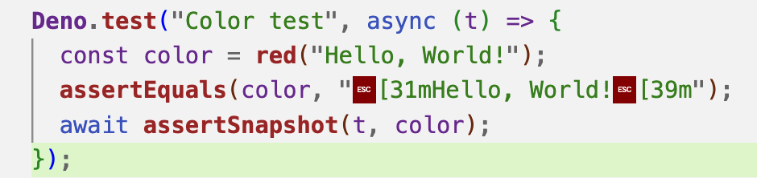

# Deno Unit Testing

## Assertions

Deno comes with a built-in testing method - `Deno.test`, which, when combined with assertions, allows for easy testing.

```typescript
import {
  assert,
  assertEquals,
  assertNotEquals,
  assertStrictEquals,
} from "https://deno.land/std@0.194.0/testing/asserts.ts";

Deno.test("Hello Test", () => {
  assert("Hello");
  assertEquals("Hello", "Hello");
  assertNotEquals(1, 2);
  assertStrictEquals("Hello", "Hello");
});
```

This assertion module provides 14 different assertion methods:

:::info

- assert(expr: unknown, msg = ""): asserts expr
- assertEquals(actual: unknown, expected: unknown, msg?: string): void
- assertExists(actual: unknown, msg?: string): void
- assertNotEquals(actual: unknown, expected: unknown, msg?: string): void
- assertStrictEquals(actual: unknown, expected: unknown, msg?: string): void
- assertAlmostEquals(actual: number, expected: number, epsilon = 1e-7, msg?:
  string): void
- assertInstanceOf(actual: unknown, expectedType: unknown, msg?: string): void
- assertStringIncludes(actual: string, expected: string, msg?: string): void
- assertArrayIncludes(actual: unknown[], expected: unknown[], msg?: string):
  void
- assertMatch(actual: string, expected: RegExp, msg?: string): void
- assertNotMatch(actual: string, expected: RegExp, msg?: string): void
- assertObjectMatch( actual: Record<PropertyKey, unknown>, expected:
  Record<PropertyKey, unknown>): void
- assertThrows(fn: () => void, ErrorClass?: Constructor, msgIncludes?: string |
  undefined, msg?: string | undefined): Error
- assertRejects(fn: () => Promise<unknown>, ErrorClass?: Constructor,
  msgIncludes?: string | undefined, msg?: string | undefined): Promise<void> 
:::

If you're accustomed to using the Chai library in Node.js, you can also reference it in Deno using the CDN.

```typescript
import chai from "https://cdn.skypack.dev/chai@4.3.4?dts";

const foo = "bar";
const beverages = { tea: ["chai", "matcha", "oolong"] };

Deno.test("we can make chai assertions", () => {
  const assert = chai.assert;

  assert.typeOf(foo, "string"); // without optional message
  assert.typeOf(foo, "string", "foo is a string"); // with optional message
  assert.equal(foo, "bar", "foo equal `bar`");
  assert.lengthOf(foo, 3, "foo`s value has a length of 3");
  assert.lengthOf(beverages.tea, 3, "beverages has 3 types of tea");
});

Deno.test("we can make chai expectations", () => {
  const expect = chai.expect;

  expect(foo).to.be.a("string");
  expect(foo).to.equal("bar");
  expect(foo).to.have.lengthOf(3);
  expect(beverages).to.have.property("tea").with.lengthOf(3);
});

Deno.test("we can use chai should style", () => {
  chai.should();

  foo.should.be.a("string");
  foo.should.equal("bar");
  foo.should.have.lengthOf(3);
  beverages.should.have.property("tea").with.lengthOf(3);
});
```

### Custom Assertion Functions

You can rely on existing assertion modules to create custom assertion functions, which can enhance readability and reduce code verbosity.

```typescript
import { AssertionError } from "https://deno.land/std@0.194.0/testing/asserts.ts";

export function assertPowerOf(
  actual: number,
  expected: number,
  msg?: string,
): void {
  let received = actual;
  while (received % expected === 0) received = received / expected;
  if (received !== 1) {
    if (!msg) {
      msg = `actual: "${actual}" expected to be a power of : "${expected}"`;
    }
    throw new AssertionError(msg);
  }
}
```

Use:

```typescript
Deno.test("Test Assert PowerOf", () => {
  assertPowerOf(8, 2);
  assertPowerOf(11, 4);
});
```

## Test Sanitizers

Deno provides three test sanitizers. The term "sanitizer" might sound a bit unusual, but it will become clear after looking at the examples below.

### Resource Sanitizers

```typescript
Deno.test({
  name: "leaky resource test",
  async fn() {
    await Deno.open("hello.txt");
  },
  sanitizeResources: false,
});
```

In this example, if `sanitizeResources` is not set to false, an error will be reported:

```systemverilog
error: Leaking resources:
- A file (rid 3) was opened during the test, but not closed during the test. Close the file handle by calling `file.close()`.
```

This is easy to understand—it indicates that a resource was opened but not closed during the test.

### Operation Sanitizers

```typescript
Deno.test({
  name: "leaky operation test",
  fn() {
    crypto.subtle.digest(
      "SHA-256",
      new TextEncoder().encode("a".repeat(100000000)),
    );
  },
  sanitizeOps: false,
});
```

`crypto.subtle.digest` is an asynchronous function that returns a Promise. If `sanitizeOps` is not set to false, an error will be reported:

```systemverilog
error: Leaking async ops:
  - 1 async operation to digest data was started in this test, but never completed. This is often caused by not awaiting the result of a `crypto.subtle.digest` call.
To get more details where ops were leaked, run again with --trace-ops flag.
```

In this case, another approach is to set `fn` as asynchronous and await the completion of this function.

```typescript
Deno.test({
  name: "leaky operation test",
  async fn() {
    await crypto.subtle.digest(
      "SHA-256",
      new TextEncoder().encode("a".repeat(100000000)),
    );
  },
});
```

### Exit Sanitizers

```typescript
Deno.test({
  name: "false success",
  fn() {
    Deno.exit(0);
  },
  sanitizeExit: false,
});

// This test never runs, because the process exits during "false success" test
Deno.test({
  name: "failing test",
  fn() {
    throw new Error("this test fails");
  },
});
```

If `sanitizeExit` is not set, after using `Deno.exit`, an error will be reported by default, and it will not block the execution of subsequent test cases:

```systemverilog
error: AssertionError: Test case attempted to exit with exit code: 0
  Deno.exit(0);
```

In summary, you should now understand that the term "sanitizer" refers to special solutions that alter Deno's default testing behavior.

## Testing Methods

There are typically two ways to write Deno tests:

```typescript
Deno.test({
  name: "test name",
  fn() {
    // Test logic
  },
});
```

Equivalent to:

```typescript
Deno.test("test name", () => {
  // Test logic
});
```

For asynchronous tests:

```typescript
Deno.test("test name", async () => {
  // Asynchronous test logic
});
```

When applying nested test cases using `t.step`, ensure to include `await` before `t.step`.

```typescript
Deno.test("User age", async (t) => {
  const user = new User("Kyle");

  await t.step("getAge", () => {
    assertThrows(() => user.getAge(), Error, "Age unknown");
    user.age = 18;
    assertEquals(user.getAge(), 18);
  });

  await t.step("setAge", () => {
    user.setAge(18);
    assertEquals(user.getAge(), 18);
  });
});
```

For more complex scenarios, you might need to execute certain code before and after each test case, such as `beforeEach` and `afterEach`. In such cases, you can combine it with another official library, [bdd](https://deno.land/std@0.194.0/testing/bdd.ts).

```typescript
import {
  afterEach,
  beforeEach,
  describe,
  it,
} from "https://deno.land/std@0.194.0/testing/bdd.ts";

describe("User", () => {
  it("users initially empty", () => {
    assertEquals(User.users.size, 0);
  });

  describe("age", () => {
    let user: User;

    beforeEach(() => {
      user = new User("Kyle");
    });

    afterEach(() => {
      User.users.clear();
    });

    it("getAge", function () {
      assertThrows(() => user.getAge(), Error, "Age unknown");
      user.age = 18;
      assertEquals(user.getAge(), 18);
    });

    it("setAge", function () {
      user.setAge(18);
      assertEquals(user.getAge(), 18);
    });
  });
});
```

The `describe` method can also be flattened out, although it's not highly recommended. If you are interested, you can check it out [here](https://deno.land/manual@v1.35.1/basics/testing/behavior_driven_development) on your own; I won't go into detail here.

## Mock

> A test spy is a function stand-in used to assert whether the internal behavior of a function meets expectations. Test spies retain the original behavior but allow you to test how a method is called and what it returns. Test stubs are an extension of test spies and can also replace the original method's behavior.

The above introduction may sound a bit convoluted. Simply put, for testing the internal logic of functions, the official documentation provides a convenient testing solution.

### Spying

For example, consider the following two functions:

```typescript
export function multiply(a: number, b: number): number {
  return a * b;
}

export function square(
  multiplyFn: (a: number, b: number) => number,
  value: number,
): number {
  return multiplyFn(value, value);
}
```

We want to test whether the `multiply` function is executed when used as a parameter for `square`. This can be achieved by wrapping this function using a spy:

```typescript
import {
  assertSpyCall,
  assertSpyCalls,
  spy,
} from "https://deno.land/std@0.194.0/testing/mock.ts";
import { assertEquals } from "https://deno.land/std@0.194.0/testing/asserts.ts";

Deno.test("square calls multiply and returns results", () => {
  const multiplySpy = spy(multiply);

  assertEquals(square(multiplySpy, 5), 25);

  // asserts that multiplySpy was called at least once and details about the first call.
  assertSpyCall(multiplySpy, 0, {
    args: [5, 5],
    returned: 25,
  });

  // asserts that multiplySpy was only called once.
  assertSpyCalls(multiplySpy, 1);
});
```

Another common scenario might be when `multiply` is only called internally within `square`. In this case, you can expose `multiply` as a property of an object (`_internals`):

```typescript
export function multiply(a: number, b: number): number {
  return a * b;
}

export function square(value: number): number {
  return _internals.multiply(value, value);
}

export const _internals = { multiply };
```

Wrap `_internals` with a spy:

```typescript
Deno.test("square calls multiply and returns results", () => {
  const multiplySpy = spy(_internals, "multiply");

  try {
    assertEquals(square(5), 25);
  } finally {
    // unwraps the multiply method on the _internals object
    multiplySpy.restore();
  }

  // asserts that multiplySpy was called at least once and details about the first call.
  assertSpyCall(multiplySpy, 0, {
    args: [5, 5],
    returned: 25,
  });

  // asserts that multiplySpy was only called once.
  assertSpyCalls(multiplySpy, 1);
});
```

:::info
The reason for this complexity is that `multiply` cannot be directly intercepted, while an object can. 
:::

Another point to note is that in the example, after calling `square`, `multiplySpy.restore()` is explicitly executed. Judging by its name, it restores it to its initial state. If this line is omitted, replaced with the following code:

```typescript
Deno.test("square calls multiply and returns results", () => {
  const multiplySpy = spy(_internals, "multiply");
  assertEquals(square(5), 25);
  assertSpyCalls(multiplySpy, 1);

  // 再执行一遍
  assertEquals(square(5), 25);
  assertSpyCalls(multiplySpy, 2);
});
```
`multiplySpy`'s call history will still be available.

### Stubbing

Now, let's look at the following functions where the return value of `randomInt` is random:

```typescript
export function randomInt(lowerBound: number, upperBound: number): number {
  return lowerBound + Math.floor(Math.random() * (upperBound - lowerBound));
}

export function randomMultiple(value: number): number {
  return value * _internals.randomInt(-10, 10);
}

export const _internals = { randomInt };
```

How do you test using the above method? If you try to write the following code, you'll realize something is off:

```typescript
const multiplySpy = spy(_internals, "randomInt");

assertEquals(randomMultiple(5), 25);
```

In this case, you need a method to mock the return value of the `randomInt` function. This is where stub functions and `returnsNext` come into play.

```typescript
import {
  assertSpyCall,
  assertSpyCalls,
  returnsNext,
  stub,
} from "https://deno.land/std@0.194.0/testing/mock.ts";

Deno.test("randomMultiple uses randomInt to generate random multiples between -10 and 10 times the value", () => {
  const randomIntStub = stub(_internals, "randomInt", returnsNext([-3, 3]));

  try {
    assertEquals(randomMultiple(5), -15);
    assertEquals(randomMultiple(5), 15);
  } finally {
    // unwraps the randomInt method on the _internals object
    randomIntStub.restore();
  }

  // asserts that randomIntStub was called at least once and details about the first call.
  assertSpyCall(randomIntStub, 0, {
    args: [-10, 10],
    returned: -3,
  });
  // asserts that randomIntStub was called at least twice and details about the second call.
  assertSpyCall(randomIntStub, 1, {
    args: [-10, 10],
    returned: 3,
  });

  // asserts that randomIntStub was only called twice.
  assertSpyCalls(randomIntStub, 2);
});
```

### Faking Time

Another common scenario is when we use `setInterval` timers in our code:

```typescript
export function secondInterval(cb: () => void): number {
  return setInterval(cb, 1000);
}
```

If we use actual time, it might result in tests taking much longer than they should. Now, we can use `FakeTime` and the `tick` method to advance the timeline:

```typescript
import {
  assertSpyCalls,
  spy,
} from "https://deno.land/std@0.194.0/testing/mock.ts";
import { FakeTime } from "https://deno.land/std@0.194.0/testing/time.ts";

Deno.test("secondInterval calls callback every second and stops after being cleared", () => {
  const time = new FakeTime();

  try {
    const cb = spy();
    const intervalId = secondInterval(cb);
    assertSpyCalls(cb, 0);
    time.tick(500);
    assertSpyCalls(cb, 0);
    time.tick(500);
    assertSpyCalls(cb, 1);
    time.tick(3500);
    assertSpyCalls(cb, 4);

    clearInterval(intervalId);
    time.tick(1000);
    assertSpyCalls(cb, 4);
  } finally {
    time.restore();
  }
});
```

## Snapshot Testing

Deno's standard library comes equipped with a snapshot module, allowing developers to write tests to compare a value against a reference snapshot. This reference snapshot is the serialized representation of the original value and is stored alongside the test file. 

Snapshot testing is useful in many scenarios, as it can capture various errors with minimal code. It is particularly helpful when it's challenging to precisely articulate what should be asserted, without the need for extensive code or in cases where assertions are expected to change frequently. Therefore, it is particularly suitable for frontend and CLI development.

Using `assertSnapshot`, you can compare the value with the file in the test directory:

```typescript
import { assertSnapshot } from "https://deno.land/std@0.194.0/testing/snapshot.ts";

Deno.test("isSnapshotMatch", async function (t): Promise<void> {
  const a = {
    hello: "world!",
    example: 123,
  };
  await assertSnapshot(t, a);
});
```

The test snapshot file would look like this:

```typescript
export const snapshot = {};

snapshot[`isSnapshotMatch 1`] = `
{
  example: 123,
  hello: "world!",
}
`;
```

If you manually modify the value of `example`, the test will fail.

Of course, you wouldn't manually write this snapshot file; instead, you use the command `deno test --allow-all -- --update` for generation and updates.

The above example is a simple case, and its power might not be immediately apparent. Suppose you are using Deno's color library:

```typescript
import { red } from "https://deno.land/std@0.194.0/fmt/colors.ts";

Deno.test("Color test", async (t) => {
  const color = red("Hello, World!");
  await assertSnapshot(t, color);
});
```

The `color` variable is printed like this:


But the snapshot file looks like this:

```typescript
export const snapshot = {};

snapshot[`Color test 1`] = `"\\x1b[31mHello, World!\\x1b[39m"`;
```

If you were to write a regular assertion, it might look like this:

```typescript
Deno.test("Color test", async (t) => {
  const color = red("Hello, World!");
  assertEquals(color, "[31mHello, World

It should actually be:

```typescript
assertEquals(color, "Hello, World!");
```



Using snapshots, you don't need to worry about these details. You just need to let the testing framework know what the output of your code looks like, and it won't allow arbitrary changes.

There are more complex use cases and configurations, but since they are not commonly needed, I won't go into them here. Interested readers can directly refer to the [official documentation](https://deno.land/manual@v1.35.1/basics/testing/snapshot_testing).

## Conclusion

This article introduced the assertion and testing methods in the Deno standard modules, as well as how to use the three sanitizers (resources, ops, and exit) to bypass built-in rules. 

Additionally, it covered how to mock internal calls in tests and an uncommon snapshot module. These modules cover most testing scenarios, and readers can flexibly apply this content to write comprehensive test cases and enhance the robustness of their code.
