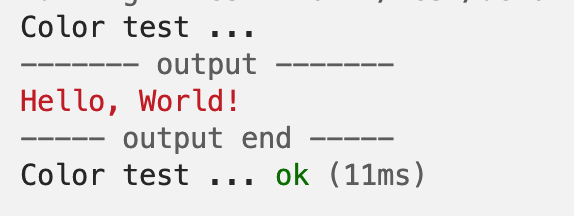

# Deno单元测试

## 断言

Deno内置了测试方法——Deno.test，结合断言可以很容易地进行测试。

```typescript
import {
  assert,
  assertEquals,
  assertNotEquals,
  assertStrictEquals,
} from "https://deno.land/std@0.194.0/testing/asserts.ts";

Deno.test("Hello Test", () => {
  assert("Hello");
  assertEquals("Hello", "Hello");
  assertNotEquals(1, 2);
  assertStrictEquals("Hello", "Hello");
});
```

这个断言模块提供了14种断言方式：

:::info

- assert(expr: unknown, msg = ""): asserts expr
- assertEquals(actual: unknown, expected: unknown, msg?: string): void
- assertExists(actual: unknown, msg?: string): void
- assertNotEquals(actual: unknown, expected: unknown, msg?: string): void
- assertStrictEquals(actual: unknown, expected: unknown, msg?: string): void
- assertAlmostEquals(actual: number, expected: number, epsilon = 1e-7, msg?:
  string): void
- assertInstanceOf(actual: unknown, expectedType: unknown, msg?: string): void
- assertStringIncludes(actual: string, expected: string, msg?: string): void
- assertArrayIncludes(actual: unknown[], expected: unknown[], msg?: string):
  void
- assertMatch(actual: string, expected: RegExp, msg?: string): void
- assertNotMatch(actual: string, expected: RegExp, msg?: string): void
- assertObjectMatch( actual: Record<PropertyKey, unknown>, expected:
  Record<PropertyKey, unknown>): void
- assertThrows(fn: () => void, ErrorClass?: Constructor, msgIncludes?: string |
  undefined, msg?: string | undefined): Error
- assertRejects(fn: () => Promise<unknown>, ErrorClass?: Constructor,
  msgIncludes?: string | undefined, msg?: string | undefined): Promise<void> 
:::

如果你习惯使用Node.js的Chai库的话，在Deno中也可以通过CDN的方式引用：

```typescript
import chai from "https://cdn.skypack.dev/chai@4.3.4?dts";

const foo = "bar";
const beverages = { tea: ["chai", "matcha", "oolong"] };

Deno.test("we can make chai assertions", () => {
  const assert = chai.assert;

  assert.typeOf(foo, "string"); // without optional message
  assert.typeOf(foo, "string", "foo is a string"); // with optional message
  assert.equal(foo, "bar", "foo equal `bar`");
  assert.lengthOf(foo, 3, "foo`s value has a length of 3");
  assert.lengthOf(beverages.tea, 3, "beverages has 3 types of tea");
});

Deno.test("we can make chai expectations", () => {
  const expect = chai.expect;

  expect(foo).to.be.a("string");
  expect(foo).to.equal("bar");
  expect(foo).to.have.lengthOf(3);
  expect(beverages).to.have.property("tea").with.lengthOf(3);
});

Deno.test("we can use chai should style", () => {
  chai.should();

  foo.should.be.a("string");
  foo.should.equal("bar");
  foo.should.have.lengthOf(3);
  beverages.should.have.property("tea").with.lengthOf(3);
});
```

### 自定义断言函数

你可以依赖于现有的断言模块，创建自定义断言函数可以提高可读性并减少代码量。

```typescript
import { AssertionError } from "https://deno.land/std@0.194.0/testing/asserts.ts";

export function assertPowerOf(
  actual: number,
  expected: number,
  msg?: string,
): void {
  let received = actual;
  while (received % expected === 0) received = received / expected;
  if (received !== 1) {
    if (!msg) {
      msg = `actual: "${actual}" expected to be a power of : "${expected}"`;
    }
    throw new AssertionError(msg);
  }
}
```

使用：

```typescript
Deno.test("Test Assert PowerOf", () => {
  assertPowerOf(8, 2);
  assertPowerOf(11, 4);
});
```

## 测试消毒剂（Test Sanitizers）

Deno提供了3种测试消毒剂。消毒剂这个名词你可能会觉得怪怪的，看了下面的例子就能理解了。

### 资源消毒剂

```typescript
Deno.test({
  name: "leaky resource test",
  async fn() {
    await Deno.open("hello.txt");
  },
  sanitizeResources: false,
});
```

这个例子，如果不将`sanitizeResources`设置为false，则会报错：

```systemverilog
error: Leaking resources:
- A file (rid 3) was opened during the test, but not closed during the test. Close the file handle by calling `file.close()`.
```

这个很好理解，打开了资源并没有关闭。

### 操作消毒剂

```typescript
Deno.test({
  name: "leaky operation test",
  fn() {
    crypto.subtle.digest(
      "SHA-256",
      new TextEncoder().encode("a".repeat(100000000)),
    );
  },
  sanitizeOps: false,
});
```

`crypto.subtle.digest`是个异步函数，返回值是个Promise。如果不设置sanitizeOps为false，会报错：

```systemverilog
error: Leaking async ops:
  - 1 async operation to digest data was started in this test, but never completed. This is often caused by not awaiting the result of a `crypto.subtle.digest` call.
To get more details where ops were leaked, run again with --trace-ops flag.
```

这时还有另一种方式是将fn设置为async等待这个函数完成。

```typescript
Deno.test({
  name: "leaky operation test",
  async fn() {
    await crypto.subtle.digest(
      "SHA-256",
      new TextEncoder().encode("a".repeat(100000000)),
    );
  },
});
```

### 退出消毒剂

```typescript
Deno.test({
  name: "false success",
  fn() {
    Deno.exit(0);
  },
  sanitizeExit: false,
});

// This test never runs, because the process exits during "false success" test
Deno.test({
  name: "failing test",
  fn() {
    throw new Error("this test fails");
  },
});
```

如果不设置sanitizeExit，在使用Deno.exit后，默认会报错，同时也不会阻塞后面测试用例的执行：

```systemverilog
error: AssertionError: Test case attempted to exit with exit code: 0
  Deno.exit(0);
```

综上，你应该已经明白所谓『消毒剂』就是为你改变Deno默认测试行为的特殊方案。

## 测试方法

Deno.test通常有2种写法：

```typescript
Deno.test({
  name: "test name",
  fn() {
  },
});
```

等价于：

```typescript
Deno.test("test name", () => {
});
```

如果遇到异步的测试：

```typescript
Deno.test("test name", async () => {
});
```

套用子测试用例，注意t.step之前加await。

```typescript
Deno.test("User age", async (t) => {
  const user = new User("Kyle");

  await t.step("getAge", () => {
    assertThrows(() => user.getAge(), Error, "Age unknown");
    user.age = 18;
    assertEquals(user.getAge(), 18);
  });

  await t.step("setAge", () => {
    user.setAge(18);
    assertEquals(user.getAge(), 18);
  });
});
```

更复杂点儿的用例，你可能需要在每个样例前后执行固定代码，比如beforeEach、afterEach，那么可以结合另一个官方库[bdd](https://deno.land/std@0.194.0/testing/bdd.ts)使用：

```typescript
import {
  afterEach,
  beforeEach,
  describe,
  it,
} from "https://deno.land/std@0.194.0/testing/bdd.ts";

describe("User", () => {
  it("users initially empty", () => {
    assertEquals(User.users.size, 0);
  });

  describe("age", () => {
    let user: User;

    beforeEach(() => {
      user = new User("Kyle");
    });

    afterEach(() => {
      User.users.clear();
    });

    it("getAge", function () {
      assertThrows(() => user.getAge(), Error, "Age unknown");
      user.age = 18;
      assertEquals(user.getAge(), 18);
    });

    it("setAge", function () {
      user.setAge(18);
      assertEquals(user.getAge(), 18);
    });
  });
});
```

describe方法也能平铺开，不是很推荐，有兴趣的在[这里](https://deno.land/manual@v1.35.1/basics/testing/behavior_driven_development)自己看看，就不介绍了。

## Mock

> 测试间谍是函数的替身，用于断言函数的内部行为是否符合预期。方法的测试间谍保留原始行为，但允许你测试方法的调用方式和返回值。测试存根是测试间谍的扩展，还可以替换原始方法的行为。

上面的介绍可能绕口些，简单来说，就是对于函数内部逻辑的测试，官方提供了一种方便的测试方案。

### Spying 间谍

比如下面有2个函数：

```typescript
export function multiply(a: number, b: number): number {
  return a * b;
}

export function square(
  multiplyFn: (a: number, b: number) => number,
  value: number,
): number {
  return multiplyFn(value, value);
}
```

我们想要测试multiply这个函数被square当作参数时有没有被执行，可以使用spy将这个函数包装：

```typescript
import {
  assertSpyCall,
  assertSpyCalls,
  spy,
} from "https://deno.land/std@0.194.0/testing/mock.ts";
import { assertEquals } from "https://deno.land/std@0.194.0/testing/asserts.ts";

Deno.test("square calls multiply and returns results", () => {
  const multiplySpy = spy(multiply);

  assertEquals(square(multiplySpy, 5), 25);

  // asserts that multiplySpy was called at least once and details about the first call.
  assertSpyCall(multiplySpy, 0, {
    args: [5, 5],
    returned: 25,
  });

  // asserts that multiplySpy was only called once.
  assertSpyCalls(multiplySpy, 1);
});
```

另一种场景可能更为常见，multiply仅是被square内部直接调用，那么可以把multiply当作一个对象（_internals）的属性暴露出去：

```typescript
export function multiply(a: number, b: number): number {
  return a * b;
}

export function square(value: number): number {
  return _internals.multiply(value, value);
}

export const _internals = { multiply };
```

将_internals包装下：

```typescript
Deno.test("square calls multiply and returns results", () => {
  const multiplySpy = spy(_internals, "multiply");

  try {
    assertEquals(square(5), 25);
  } finally {
    // unwraps the multiply method on the _internals object
    multiplySpy.restore();
  }

  // asserts that multiplySpy was called at least once and details about the first call.
  assertSpyCall(multiplySpy, 0, {
    args: [5, 5],
    returned: 25,
  });

  // asserts that multiplySpy was only called once.
  assertSpyCalls(multiplySpy, 1);
});
```

:::info
之所以这样麻烦，是因为multiply不能被直接劫持，而对象可以。 
:::

另一点需要注意的是，例子中调用square后显式执行`multiplySpy.restore()`，从命名上看，它就是恢复为初始状态。
如果没有这一句，换成以下代码：

```typescript
Deno.test("square calls multiply and returns results", () => {
  const multiplySpy = spy(_internals, "multiply");
  assertEquals(square(5), 25);
  assertSpyCalls(multiplySpy, 1);

  // 再执行一遍
  assertEquals(square(5), 25);
  assertSpyCalls(multiplySpy, 2);
});
```

multiplySpy的调用记录就还在。

### Stubbing 存根

再看下面的函数，randomInt的返回值是随机的：

```typescript
export function randomInt(lowerBound: number, upperBound: number): number {
  return lowerBound + Math.floor(Math.random() * (upperBound - lowerBound));
}

export function randomMultiple(value: number): number {
  return value * _internals.randomInt(-10, 10);
}

export const _internals = { randomInt };
```

换用上面的方法你怎么测试？你可能照猫画虎写到下面的代码就知道不对劲了：

```typescript
const multiplySpy = spy(_internals, "randomInt");

assertEquals(randomMultiple(5), 25);
```

这时需要一种方法，Mock掉randomInt这个函数的返回值，这就是stub函数和returnsNext。

```typescript
import {
  assertSpyCall,
  assertSpyCalls,
  returnsNext,
  stub,
} from "https://deno.land/std@0.194.0/testing/mock.ts";

Deno.test("randomMultiple uses randomInt to generate random multiples between -10 and 10 times the value", () => {
  const randomIntStub = stub(_internals, "randomInt", returnsNext([-3, 3]));

  try {
    assertEquals(randomMultiple(5), -15);
    assertEquals(randomMultiple(5), 15);
  } finally {
    // unwraps the randomInt method on the _internals object
    randomIntStub.restore();
  }

  // asserts that randomIntStub was called at least once and details about the first call.
  assertSpyCall(randomIntStub, 0, {
    args: [-10, 10],
    returned: -3,
  });
  // asserts that randomIntStub was called at least twice and details about the second call.
  assertSpyCall(randomIntStub, 1, {
    args: [-10, 10],
    returned: 3,
  });

  // asserts that randomIntStub was only called twice.
  assertSpyCalls(randomIntStub, 2);
});
```

### Faking time 假时间

还有种常见的情况是，我们在代码中可能会使用setInterval定时器：

```typescript
export function secondInterval(cb: () => void): number {
  return setInterval(cb, 1000);
}
```

如果使用实际时间，这可能会导致测试花费的时间比应有的时间长得多。现在我们可以使用FakeTime和tick方法，来推进时间线的演进：

```typescript
import {
  assertSpyCalls,
  spy,
} from "https://deno.land/std@0.194.0/testing/mock.ts";
import { FakeTime } from "https://deno.land/std@0.194.0/testing/time.ts";

Deno.test("secondInterval calls callback every second and stops after being cleared", () => {
  const time = new FakeTime();

  try {
    const cb = spy();
    const intervalId = secondInterval(cb);
    assertSpyCalls(cb, 0);
    time.tick(500);
    assertSpyCalls(cb, 0);
    time.tick(500);
    assertSpyCalls(cb, 1);
    time.tick(3500);
    assertSpyCalls(cb, 4);

    clearInterval(intervalId);
    time.tick(1000);
    assertSpyCalls(cb, 4);
  } finally {
    time.restore();
  }
});
```

## 快照测试

Deno
标准库配备了一个快照模块，使开发人员能够编写测试来比较一个值与参考快照。这个参考快照是原始值的序列化表示，并与测试文件一起存储。快照测试在许多情况下都很有用，因为它可以用非常少的代码来捕获各种错误。它特别有助于在难以精确表达应该断言什么的情况下使用，而不需要大量的代码，或者测试所做的断言预计经常更改的情况下。因此，它特别适用于前端和
CLI 的开发。

使用assertSnapshot，与测试目录的文件作对比：

```typescript
import { assertSnapshot } from "https://deno.land/std@0.194.0/testing/snapshot.ts";

Deno.test("isSnapshotMatch", async function (t): Promise<void> {
  const a = {
    hello: "world!",
    example: 123,
  };
  await assertSnapshot(t, a);
});
```

测试快照文件：

```typescript
export const snapshot = {};

snapshot[`isSnapshotMatch 1`] = `
{
  example: 123,
  hello: "world!",
}
`;
```

如果你手动修改了example的值，那么测试就会失败。

当然，我们不可能手动编写这个快照文件，而是用命令`deno test --allow-all -- --update`进行生成和更新。

上面的样例是个最简单的用例，你可能看不出它的威力。假如你用了Deno的颜色库：

```typescript
import { red } from "https://deno.land/std@0.194.0/fmt/colors.ts";

Deno.test("Color test", async (t) => {
  const color = red("Hello, World!");
  await assertSnapshot(t, color);
});
```

这里的color变量打印出来是这样的：



但快照文件是这样的：

```typescript
export const snapshot = {};

snapshot[`Color test 1`] = `"\\x1b[31mHello, World!\\x1b[39m"`;
```

如果你正常写断言可能是这样的：

```typescript
Deno.test("Color test", async (t) => {
  const color = red("Hello, World!");
  assertEquals(color, "[31mHello, World吧。

## 总结

本文介绍了Deno标准模块中的断言与测试方法，以及如何使用资源、操作、退出三种消毒剂来跳过内置规则。此外，本文还介绍了如何在测试中Mock函数内部的调用，以及一个并不常用的快照模块。这些模块已经覆盖了测试的大部分场景，读者可以灵活运用这些内容，编写完善的测试用例，提高代码的健壮性。
