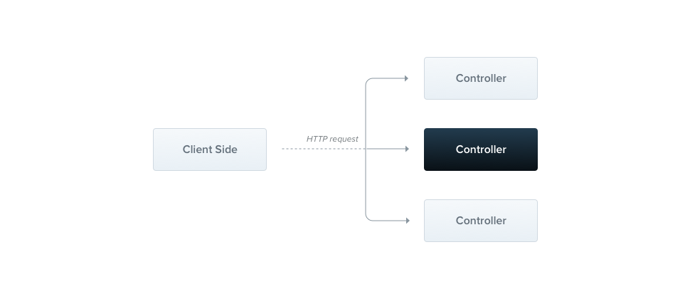

---
group:
  title: 概述
order: 2
---

# 控制器

Controllers（控制器）负责处理传入的请求并向客户端返回响应。



一个 Controller 的目的是接收应用程序的特定请求。路由机制控制哪个 Controller 接收哪个请求。通常，每个 Controller 都有多个路由，并且不同的路由可以执行不同的操作。

为了创建一个基本的 Controller，我们使用类和装饰器。装饰器将类与所需的元数据关联起来，并使 Nest 能够创建一个路由映射（将请求与相应的 Controller 关联起来）。

## 路由

在以下示例中，我们将使用`@Controller()`装饰器，该装饰器是定义基本控制器所必需的。

我们将指定一个可选的路由路径前缀`cats`。在`@Controller()`装饰器中使用路径前缀可以轻松地将一组相关路由分组，并最小化重复代码。

例如，我们可以选择将管理与猫实体的交互的一组路由分组到路由`/cats`下。在这种情况下，我们可以在`@Controller()`装饰器中指定路径前缀`cats`，以便我们不必在文件中为每个路由重复该部分路径。

```typescript
import { Controller, Get } from '@nest';

@Controller('cats')
export class CatsController {
  @Get('/')
  findAll(): string {
    return 'This action returns all cats';
  }
}
```

:::info
使用 CLI 创建 Controller，只需执行`nests g`，再选择`Controller`。
:::

`@Get()`HTTP 请求方法装饰器位于`findAll()`方法之前，告诉 Nest 为特定的 HTTP 请求端点创建一个处理程序。端点对应于 HTTP 请求方法（在本例中为 GET）和路由路径。

什么是路由路径？处理程序的路由路径是通过连接控制器的（可选）前缀声明和方法装饰器中指定的任何路径来确定的。

由于我们为每个路由声明了一个前缀（cats），并且在装饰器中没有添加任何路径信息，Nest 将把`GET /cats`请求映射到此处理程序。

如前所述，路径包括可选的控制器路径前缀和请求方法装饰器中声明的任何路径字符串。例如，路径前缀为 cats，结合装饰器`@Get('breed')`，将生成用于`GET /cats/breed`请求的路由映射。

在上面的示例中，当向此端点发出 GET 请求时，Nest 将请求路由到我们自定义的`findAll()`方法。请注意，我们在这里选择的方法名完全是任意的。我们显然必须声明一个要绑定到的方法，但是 Nest 不会对所选择的方法名附加任何意义。

此方法将返回一个 200 状态码和关联的响应，在本例中只是一个字符串。为什么会这样呢？为了解释这一点，我们首先介绍 Nest 使用两种不同选项来操作响应的概念：

| 类型             | 说明                                                                                                                                                                                                                                                                                                                                                          |
| ---------------- | ------------------------------------------------------------------------------------------------------------------------------------------------------------------------------------------------------------------------------------------------------------------------------------------------------------------------------------------------------------- |
| 标准（推荐）     | 当请求处理程序返回一个 JavaScript 对象或数组或数字或 bool 时，Nest 将自动序列化为 JSON。然而，当它返回一个字符串时，Nest 将只发送该值而不尝试序列化它，并将响应标头中`Content-Type`设置为`text/html`。此外，默认情况下，响应的状态代码始终为 200，除非额外启用`etag`的中间件以开启协商缓存。我们可以通过在处理程序级别添加`@HttpCode`装饰器来轻松更改此行为。 |
| 装饰器（`@Res`） | 在方法处理程序签名中使用`@Res()`装饰器进行注入（例如`findAll(@Res() response)`）。使用这种方法，你可以使用该对象公开的处理方法，比如使用`response.status = 201`与`response.body = "Hello world"`来修改响应的状态码与内容。而 body 的内容，与上面标准的规则一致。                                                                                              |

## 请求对象

处理程序通常需要访问客户端请求的详细信息。Nest 提供对请求对象的访问，它是有别于 hono 与 oak 的上层抽象，目前暴露了常用的方法。我们可以通过在处理程序的签名中添加`@Req()`装饰器来指示 Nest 注入请求对象，从而访问请求对象。

```typescript
import { Controller, Get, Req, type Request } from '@nest';

@Controller('cats')
export class CatsController {
  @Get()
  findAll(@Req() request: Request): string {
    return 'This action returns all cats';
  }
}
```

:::warning{title=注意}
`Request`的类型需要从`@nest`核心库中导出，并添加`type`关键字标识。
:::

request 对象表示 HTTP 请求，并具有请求查询字符串、参数、HTTP 头和正文的属性。在大多数情况下，没有必要手动获取这些属性。我们可以使用专用的装饰器，例如`@Body()`或`@Query()`，它们是现成的。下面列出了所提供的装饰器以及它们所代表的普通平台特定对象。

| 装饰器                    | 说明                                                                                                                    |
| ------------------------- | ----------------------------------------------------------------------------------------------------------------------- |
| `@Req()`                  | Request                                                                                                                 |
| `@Res()`                  | Response                                                                                                                |
| `@Body(key?: string)`     | 请求对象的 Body，Nest 内置了使用`deno_class_validator`进行参数校验。如果传递了 key，表示是具体某个值，否则响应为 Object |
| `@Params(key?: string)`   | URL 路径中的参数，如`/user/:id`中的 id。                                                                                |
| `@Query(key?: string)`    | URL 后面的参数，也就是 URLSearchParams，如`?id=123`中的 id                                                              |
| `@Cookies()`              | 请求对象对应的`Nest`内置的`Cookie`对象                                                                                  |
| `@Cookie(name: string)`   | 获取某个 Cookie 值                                                                                                      |
| `@Headers(name?: string)` | 请求对象的 Header，如果不传递 name，则是 Headers                                                                        |
| `@Ip()`                   | 请求对象 Header 中`x-real-ip`或`x-forwarded-for`                                                                        |
| `@Host()`                 | 请求对象 Header 中`host`                                                                                                |
| `@MethodName()`           | 当前请求的方法名，在上例中为`findAll`                                                                                   |
| `@ControllerName()`       | 当前请求的 Controller 名称，在上例中为`CatsController`                                                                  |
| `@Form()`                 | 当参数为表单或者`FormData`时，可像 Body 一样进行参数校验，返回一个 Object                                               |

## Status code

如前所述，响应状态代码默认情况下始终为 200。我们可以通过在处理程序级别添加`@HttpCode`装饰器来轻松地更改这种行为。

```typescript
import { HttpCode } from "@nest/core";

@Post("")
@HttpCode(204)
create() {
  return 'This action adds a new cat';
}
```

另一种方式是使用`@Res`装饰器：

```typescript
import { Res, type Response } from "@nest/core";

@Post("")
create(@Res() res: Response) {
  res.status = 204;
  return 'This action adds a new cat';
}
```

:::warning{title=注意}
`Response`的类型需要从`@nest`核心库中导出，并添加`type`关键字标识。
:::

## Headers

要指定自定义响应标头，可以使用`@Header`装饰器：

```typescript
import { Header } from "@nest/core";

@Post("")
@Header('Cache-Control', 'none')
create() {
  return 'This action adds a new cat';
}
```

或者直接使用`@Res`装饰器修改 headers：

```typescript
import { Res, type Response } from "@nest/core";

@Post("")
create(@Res() res: Response) {
  res.headers.set("Cache-Control', 'none');
  return 'This action adds a new cat';
}
```

## Redirect

要将响应重定向到特定的 URL，可以使用`@Redirect ()`装饰符。`@Redirect()`接受两个参数，`url`和`statusCode`，后者是可选的，默认为 302。

```typescript
import { Redirect } from "@nest/core";

@Get("")
@Redirect('https://nests.deno.dev', 301)
```

或者直接使用`@Res`装饰器修改 headers：

```typescript
import { Res, type Response } from "@nest/core";

@Post("")
create(@Res() res: Response) {
  res.headers.set("Location', 'https://nests.deno.dev');
  res.status = 301;
  return 'This action adds a new cat';
}
```

## 路由参数

当您需要接受**动态数据**作为请求的一部分时，带有静态路径的路由将无法工作(例如，`GET/cat/1`获取`id` 为 1 的 `cat`)。为了定义带有参数的路由，我们可以在路由的路径中添加路由参数令牌，以捕获请求 URL 中该位置的动态值。

下面`@Get()`装饰器示例中的路由参数标记演示了这种用法。以这种方式声明的路由参数可以使用`@Param()`装饰符访问，它应该添加到方法签名中。

```typescript
import { Params } from "@nest/core";

@Get(":id")
findOne(@Params() params: any): string {
  console.log(params.id);
  return `This action returns a #${params.id} cat`;
}
```

也可以直接传递 key 值`id`作为参数：

```typescript
@Get(":id")
findOne(@Params('id') id: string): string {
  return `This action returns a #${id} cat`;
}
```

## 异步

每个方法都可以是异步的：

```typescript
@Get('')
async findAll(): Promise<any[]> {
  return [];
}
```

:::warning{title=注意}
有别于`NestJS`，`deno_nest`不准备支持`RxJS`的`Observable`相关能力。
:::

## 请求参数

### POST 的参数

我们之前的`POST` 路由处理程序示例不接受任何客户端参数。让我们通过在这里添加`@Body()`装饰器来修复这个问题。
DTO（数据传输对象）是一个定义如何通过网络发送数据的对象。我们可以通过使用 TypeScript 接口或简单的类来确定 DTO 模式。

让我们创建 CreateCatDto 的接口：

```typescript
export interface CreateCatDto {
  name: string;
  age: number;
  breed: string;
}
```

它只有三个基本属性，之后我们可以在 CatsController 中使用新创建的 DTO:

```typescript
@Post('')
async create(@Body() createCatDto: CreateCatDto) {
  return 'This action adds a new cat';
}
```

不过，通常来说，我们不要相信客户端传来的任何参数，一般需要进行额外的校验。幸运的是，Nest 内置了这个校验工作，只需要将 DTO 的`interface`修改为`class`，并使用[class_validator](https://deno.land/x/deno_class_validator@v1.0.0/mod.ts)：

```typescript
import { IsNumber, IsString, Max, MaxLength, Min } from 'class_validator';

export class CreateCatDto {
  @IsString()
  @MaxLength(100)
  name: string;

  @IsNumber()
  @Max(100)
  @Min(1)
  age: number;

  @IsString()
  breed: string;
}
```

如果参数校验失败，默认会响应一个状态码为 400 的异常，响应体为 JSON：

```json
{
  "statusCode": 400,
  "message": "pageNum must not be less than 1, pageNum must not be greater than 2, pageCount must not be less than 1, pageCount must not be greater than 5",
  "error": "params not valid"
}
```

这个异常的类型是 HttpException，可以被 ExceptionFilter 捕获到，具体如何下文会讲。

:::warning
有趣的是，`class_validator`只能工作于`class`。为什么呢？

`class`是 JavaScript ES6 标准的一部分，因此它们作为实际实体保存在已编译的 JavaScript 中。而 TypeScript 接口会在转换过程中被删除，`Nest`不能在运行时引用它们。理解这一点很重要。
:::

### GET 的参数

与 POST 的参数不同的是，GET 请求的参数都在 URL 中，类型全是字符串。如果想要将 bool、数字甚至数组转换为相应的格式，有个额外的装饰器`@Property()`可以帮助你：

```typescript
import { Property } from '@nest/core';

export class Dto {
  @Property()
  pageNum: number;

  @Property()
  sex: boolean;

  @Property('number')
  ages: number[];
}
```

它会转换`?pageNum=1&&sex=true&ages=1,2`为：

```json
{
  "pageNum": 1,
  "sex": true,
  "ages": [1, 2]
}
```

你仍然可以使用`class_validator`来校验参数。

## 完整资源示例

下面的示例使用了几个可用的装饰器来创建一个基本控制器。这个控制器公开了几种访问和操作内部数据的方法。

```typescript
import { Controller, Get, Query, Post, Body, Put, Param, Delete } from '@nest';
import { CreateCatDto, UpdateCatDto, ListAllEntities } from './dto.ts';

@Controller('cats')
export class CatsController {
  @Post('')
  create(@Body() createCatDto: CreateCatDto) {
    return 'This action adds a new cat';
  }

  @Get('')
  findAll(@Query() query: ListAllEntities) {
    return `This action returns all cats (limit: ${query.limit} items)`;
  }

  @Get(':id')
  findOne(@Param('id') id: string) {
    return `This action returns a #${id} cat`;
  }

  @Put(':id')
  update(@Param('id') id: string, @Body() updateCatDto: UpdateCatDto) {
    return `This action updates a #${id} cat`;
  }

  @Delete(':id')
  remove(@Param('id') id: string) {
    return `This action removes a #${id} cat`;
  }
}
```

## 启动运行

在完全定义了上面的控制器之后，Nest 仍然不知道 `CatsController` 的存在，因此不会创建这个类的实例。

控制器总是属于一个模块，这就是为什么我们在`@Module()`装饰器中包含控制器数组的原因。因为我们还没有定义除了根 AppModule 之外的任何其他模块，所以我们将使用它来引入 CatsController:

```typescript
import { Module } from '@nest';
import { CatsController } from './cats/cats.controller.ts';

@Module({
  controllers: [CatsController],
})
export class AppModule {}
```

我们使用`@Module()`装饰器将元数据附加到模块类，Nest 现在可以轻松地反映必须挂载哪些控制器。
