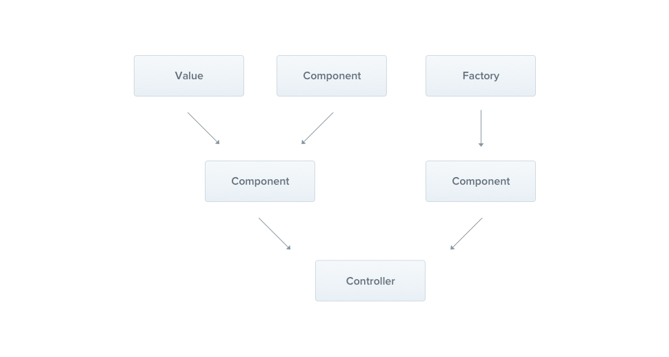

---
group:
  title: 概述
order: 3
---

# 提供者

Providers（提供者）是 Nest 中的一个基本概念。许多基本的 Nest 类可以被视为提供者——服务、存储库、工厂、帮助程序等等。提供者的主要思想是它可以作为一个依赖项注入; 这意味着对象可以彼此创建各种关系，并且“连接”这些对象的功能很大程度上可以委托给 Nest 运行时系统。



在前一章中，我们构建了一个简单的`CatsController`。控制器应该处理 HTTP 请求，并将更复杂的任务委托给提供程序。提供程序是在模块中声明为提供程序的普通 JavaScript 类。

:::info
由于 Nest 允许以更面向对象的方式设计和组织依赖项，因此我们强烈建议遵循`SOLID`原则。
:::

## Services

让我们从创建一个简单的 `CatsService` 开始。这个服务将负责数据存储和检索，并被设计用于 `CatsController`，因此它是定义为提供者的一个很好的候选者。

```typescript
import { Injectable } from '@nest';
import { Cat } from './interfaces/cat.interface.ts';

@Injectable()
export class CatsService {
  private readonly cats: Cat[] = [];

  create(cat: Cat) {
    this.cats.push(cat);
  }

  findAll(): Cat[] {
    return this.cats;
  }
}
```

:::info
你可以根据CLI创建一个service, 只需要执行 `nest g`，再选择Service。
:::

我们的 `CatsService` 是一个具有一个属性和两个方法的基本类。唯一的新特性是它使用`@Injectable()`装饰器。

`@injectable()`装饰器附加元数据，元数据声明 `CatsService` 是一个可以由 Nest IoC 容器管理的类。顺便说一下，这个例子也使用了一个 Cat 接口，它可能看起来像这样:

```typescript
export interface Cat {
  name: string;
  age: number;
  breed: string;
}
```

现在我们有了一个检索 cat 的服务类，让我们在 CatsController 中使用它:

```typescript
import { Controller, Get, Post, Body } from '@nest';
import { CreateCatDto } from './dto/create-cat.dto.ts';
import { CatsService } from './cats.service.ts';
import { Cat } from './interfaces/cat.interface.ts';

@Controller('cats')
export class CatsController {
  constructor(private catsService: CatsService) {}

  @Post('')
  async create(@Body() createCatDto: CreateCatDto) {
    this.catsService.create(createCatDto);
  }

  @Get('')
  async findAll(): Promise<Cat[]> {
    return this.catsService.findAll();
  }
}
```

`CatsService` 是通过类构造函数注入的。注意`private`**语法**的使用。这个速记允许我们立即在同一位置声明和初始化 `catsService` 成员。

## 依赖注入

Nest 是围绕强大的设计模式建立的，这种模式通常被称为依赖注入。我们推荐在官方的 [Angular 文档](https://angular.io/guide/dependency-injection)中阅读一篇关于这个概念的文章。

在 Nest 中，由于有了 TypeScript 功能，管理依赖关系变得非常容易，因为它们只需通过类型进行解析。在下面的示例中，Nest 将通过创建和返回`CatsService`的实例来解析`catsService`(或者，在单例的正常情况下，如果已经在其他地方请求了现有实例，则返回它)。解析此依赖项并将其传递给控制器的构造函数(或分配给指定的属性) :

```typescript
constructor(private catsService: CatsService) {}
```

## Scope

提供者通常有一个与应用程序生命周期同步的生命周期（`Scope`）。在引导应用程序时，必须解析每个依赖项，因此必须实例化每个提供程序。类似地，当应用程序关闭时，每个提供程序都将被销毁。

但是，也有一些方法可以使您的提供程序生存期成为请求范围。你可以在[这里](./13_scope)了解更多关于这些技术的信息。

## Provider注入

现在我们已经定义了一个提供者（`CatsService`），并且有了该服务的使用者(`CatsController`) ，我们需要向 Nest 注册该服务，以便它能够执行注入。

如果是NestJS，我们必须通过编辑我们的模块文件（`app.module.ts`）并将服务添加到`@Module()`装饰器的提供者数组来完成此操作。

```typescript
import { Module } from '@nest';
import { CatsController } from './cats/cats.controller.ts';
import { CatsService } from './cats/cats.service.ts';

@Module({
  controllers: [CatsController],
  providers: [CatsService],
})
export class AppModule {}
```

庆幸的是，我们的`deno_nest`不需要显式地进行这一步骤，它会自动解析`Controller`的依赖关系。

但我们仍然保留了这个能力，因为在某种特定的情况下仍然需要，比如一个定时任务（CRON Job）的Service，它可能并不会被任何Controller引用，这时就需要手动将它添加；又或者你需要某个Service提前初始化，也可以添加到这里改变默认的初始顺序。
