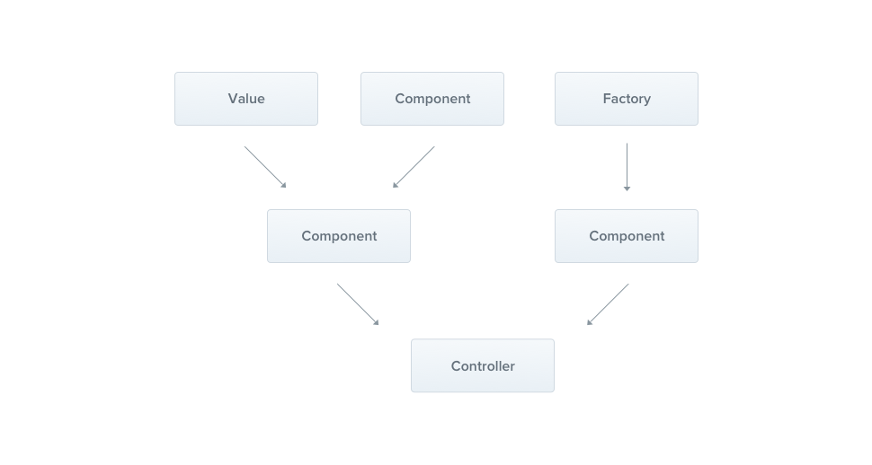

---
group:
  title: Overview
order: 3
---

# Providers

Providers are a fundamental concept in Nest. Many basic Nest classes can be considered as providers—services, repositories, factories, helpers, and more. The main idea of providers is that they can be injected as dependencies, meaning objects can create various relationships with each other, and the functionality of "connecting" these objects can be largely delegated to the Nest runtime system.



In the previous chapter, we built a simple `CatsController`. Controllers should handle HTTP requests and delegate more complex tasks to providers. Providers are ordinary JavaScript classes declared as providers in a module.

:::info
Since Nest allows designing and organizing dependencies in a more object-oriented way, we strongly recommend following the `SOLID` principles.
:::

## Services

Let's start by creating a simple `CatsService`. This service will be responsible for data storage and retrieval and is designed for use in `CatsController`, making it a good candidate for a provider.

```typescript
import { Injectable } from '@nest';
import { Cat } from './interfaces/cat.interface.ts';

@Injectable()
export class CatsService {
  private readonly cats: Cat[] = [];

  create(cat: Cat) {
    this.cats.push(cat);
  }

  findAll(): Cat[] {
    return this.cats;
  }
}
```

:::info
You can create a service using the CLI by simply running `nests g` and then selecting `Service`.
:::

Our `CatsService` is a basic class with one property and two methods. The only new feature is that it uses the `@Injectable()` decorator.

The `@Injectable()` decorator attaches metadata, declaring that `CatsService` is a class that can be managed by the Nest IoC container. By the way, this example also uses a `Cat` interface, which might look like this:

```typescript
export interface Cat {
  name: string;
  age: number;
  breed: string;
}
```

Now that we have a service class for retrieving cats, let's use it in the `CatsController`:

```typescript
import { Controller, Get, Post, Body } from '@nest';
import { CreateCatDto } from './dto/create-cat.dto.ts';
import { CatsService } from './cats.service.ts';
import { Cat } from './interfaces/cat.interface.ts';

@Controller('cats')
export class CatsController {
  constructor(private catsService: CatsService) {}

  @Post('')
  async create(@Body() createCatDto: CreateCatDto) {
    this.catsService.create(createCatDto);
  }

  @Get('')
  async findAll(): Promise<Cat[]> {
    return this.catsService.findAll();
  }
}
```

`CatsService` is injected through the class constructor. Pay attention to the use of the `private` syntax. This shorthand allows us to declare and initialize the `catsService` member immediately in the same location.

## Dependency Injection

Nest is built around a powerful design pattern known as dependency injection. We recommend reading an article on this concept in the official [Angular documentation](https://angular.io/guide/dependency-injection).

In Nest, managing dependencies becomes straightforward due to the capabilities of TypeScript, as they are resolved simply through types. In the example below, Nest will resolve the `catsService` by creating and returning an instance of `CatsService` (or, in the normal case of a singleton, returning the existing instance if it has already been requested elsewhere). This dependency is resolved and passed to the controller's constructor (or assigned to the specified property):

```typescript
constructor(private catsService: CatsService) {}
```

## Scope

Providers typically have a lifecycle, known as `Scope`, that is synchronized with the application's lifecycle. When bootstrapping the application, each dependency must be resolved, leading to the instantiation of each provider. Similarly, when the application is shutting down, each provider will be destroyed.

However, there are also ways to make your providers have a request-scoped lifetime. You can learn more about these techniques [here](./13_scope.en-US.md).

## Provider Injection

Now that we have defined a provider (`CatsService`) and a consumer of that service (`CatsController`), we need to register the service with Nest so that it can perform injection.

In NestJS, to accomplish this, we have to edit our module file (`app.module.ts`) and add the service to the providers array of the `@Module()` decorator.

```typescript
import { Module } from '@nest';
import { CatsController } from './cats/cats.controller.ts';
import { CatsService } from './cats/cats.service.ts';

@Module({
  controllers: [CatsController],
  providers: [CatsService],
})
export class AppModule {}
```

Fortunately, for our `deno_nest`, there is no need to explicitly perform this step; it automatically resolves dependencies for controllers.

However, we still retain this capability because there are specific situations where it might be necessary. For instance, a service for a scheduled task (CRON Job) that may not be referenced by any controller would need to be manually added. Similarly, if you need a service to be initialized in advance, you can add it here to alter the default initialization order.
