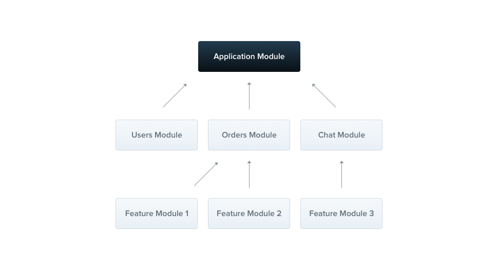
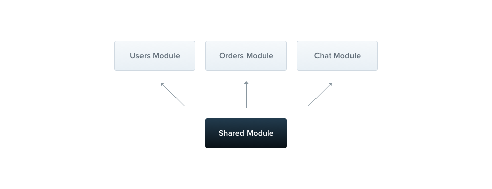

---
group:
  title: Overview
order: 4
---

# Modules

A module is a class with the `@Module()` decorator. The `@Module()` decorator provides metadata for Nest to organize the application structure.



Every application has at least one module, known as the **root module**. The root module serves as the starting point for Nest to build the application graph—a data structure Nest uses to resolve relationships and dependencies between modules and providers. While theoretically, very small applications might have only the root module, this is not typical. It is strongly recommended to use modules as an effective way to organize components. Therefore, for most applications, the generated architecture will involve multiple modules, each encapsulating a closely related set of features.

The `@Module()` decorator takes a single object that describes the module properties.

| Key          | Description                                                |
| ------------ | ---------------------------------------------------------- |
| `providers`  | These providers will be instantiated by the Nest injector and can be shared at least among the modules. |
| `controllers`| A set of controllers that must be instantiated within this module. |
| `imports`    | A list of modules that are imported and export the providers required in this module. |
| `exports`    | A subset of providers provided by this module, making them available in other modules that import this one. You can use either the providers themselves or just their tokens (`provide` values). |

The module encapsulates providers by default. This means that providers that don't directly belong to the current module or are not exported from the imported modules cannot be injected. Therefore, providers exported by the module can be seen as the public interface or API of the module.

## Feature Modules

`CatsController` and `CatsService` belong to the same application domain. Since they are closely related, moving them into a feature module makes sense.

Feature modules are simply a way to organize code related to a specific feature, keeping the code organized and establishing clear boundaries. This helps us manage complexity and develop according to SOLID principles, especially as the application and/or team scale.

To illustrate this, we will create a `CatsModule`.

```typescript
import { Module } from '@nest';
import { CatsController } from './cats.controller.ts';
import { CatsService } from './cats.service.ts';

@Module({
  controllers: [CatsController],
  // providers: [CatsService],
})
export class CatsModule {}
```

:::info
To create a module using the CLI, simply run `nests g` and choose `Module`.
:::

Above, we defined the `CatsModule` in the `cats.module.ts` file and moved all content related to this module into the `cats` directory. The last thing we need to do is to import this module into the root module (`AppModule`, defined in the `app.module.ts` file).


```bash
src
|-- app.module.ts
|-- cats
|   |-- cats.controller.ts
|   |-- cats.module.ts
|   |-- cats.service.ts
|   |-- dto
|   |   `-- create-cat.dto.ts
|   `-- interfaces
|       `-- cat.interface.ts
`-- main.ts
```

## Shared Modules

In `Nest`, modules are singleton by default, so you can easily share the same instance of any provider between multiple modules.



Each module automatically becomes a shared module. Once created, it can be reused by any other module. Suppose we want to share the instance of `CatsService` between several other modules. To achieve this, we first need to add the `CatsService` provider to the `exports` array of the module, as shown below:

```typescript
import { Module } from '@nest';
import { CatsController } from './cats.controller.ts';
import { CatsService } from './cats.service.ts';

@Module({
  controllers: [CatsController],
  providers: [CatsService],
  exports: [CatsService]
})
export class CatsModule {}
```

Now, any module that imports `CatsModule` can access the `CatsService` and share the same instance with all other modules that import it.

## Global Modules

It can become tedious if you have to import the same set of modules everywhere. Unlike `Angular`, where `Providers` are registered globally, `Nest` encapsulates providers within the module scope. They cannot be used elsewhere unless the encapsulating module is imported first.

When you want to provide a set of providers that should be available anywhere and anytime (e.g., helpers, database connections), use the `@Global` decorator to make the module global.

```typescript
import { Module, Global } from '@nest';
import { CatsController } from './cats.controller.ts';
import { CatsService } from './cats.service.ts';

@Global()
@Module({
  controllers: [CatsController],
  providers: [CatsService],
  exports: [CatsService],
})
export class CatsModule {}
```

The `@Global()` decorator makes the module global in scope. Global modules should be registered only once, typically by the root module or core module. In the example above, the `CatsService` provider will be available everywhere, and modules that wish to inject this service will not need to import `CatsModule` in their `imports` array.

:::info
Making everything global is not a good design decision. Global modules can be used to reduce the amount of boilerplate code required. The `imports` array is usually the preferred way to make a module's API available to consumers.
:::

## Dynamic Modules

The Nest module system includes a powerful feature called Dynamic Modules. This feature allows you to easily create customizable modules that can be dynamically registered and configured by providers. Dynamic Modules are detailed here. In this chapter, we will briefly overview to complete the introduction to the modules.

Here's an example definition of a Dynamic Module for `DatabaseModule`:

```typescript
import { type DynamicModule } from "@nest";
import { ES_KEY } from "./es.constant.ts";
import { ElasticsearchService } from "./es.service.ts";
import type { ElasticSearchOptions } from "./types.ts";

export class ElasticsearchModule {
  static forRoot(options: ElasticSearchOptions): DynamicModule {
    return {
      module: ElasticsearchModule,
      providers: [{
        provide: ES_KEY,
        useValue: options,
      }, ElasticsearchService],
      global: true,
    };
  }
}
```

:::info
If you want to register a dynamic module at the global level, set the `global` property to true.
:::

You can import and configure the `ElasticsearchModule` as follows:

```typescript
import { Module } from "@nest";
import { ElasticsearchModule } from "@nest/elasticsearch";
import { AppController } from "./app.controller.ts";

@Module({
  imports: [
    ElasticsearchModule.forRoot({
      db: "http://10.100.30.65:9200",
    }),
  ],
  controllers: [AppController],
})
export class AppModule {}
```
