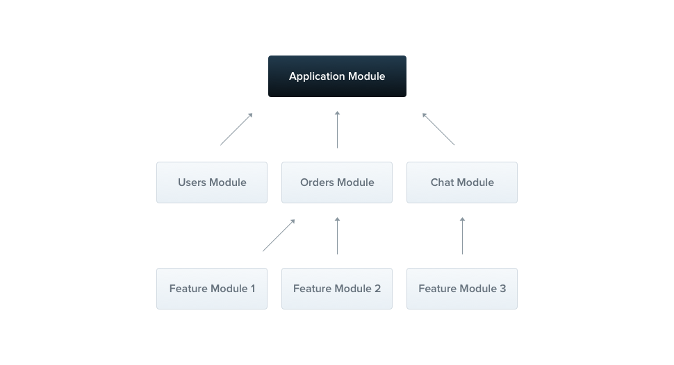
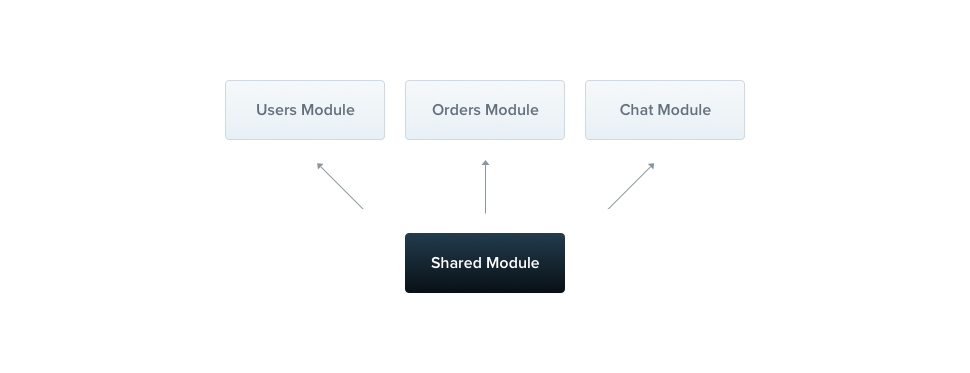

---
group:
  title: 概述
order: 4
---

# 模块

模块是一个带有`@Module()`装饰器的类。`@Module()`装饰器提供了 Nest 用来组织应用程序结构的元数据。



每个应用程序至少有一个模块，即**根模块**。根模块是Nest用于构建应用程序图的起点——内部数据结构Nest用于解析模块和提供程序之间的关系和依赖关系。虽然理论上很小的应用程序可能只有根模块，但这不是典型情况。我们强烈建议使用模块作为组织组件的有效方式。因此，对于大多数应用程序，生成的架构将使用多个模块，每个模块封装一个密切相关的功能集。

`@Module()`装饰器接受一个描述模块属性的单个对象。

| key | 说明 |
| --- | --- |
| `providers` | 这些提供者将由Nest注入器实例化，并且至少可以在该模块之间共享 |
| `controllers` | 在此模块中定义的一组必须实例化的控制器 |
| `imports` | 导入的模块列表，这些模块导出了在该模块中所需的提供者 |
| `exports` | 该模块提供的提供者的子集，并且应该在导入该模块的其它模块中可用。你可以使用提供程序本身，也可以仅使用其令牌（`provide`值）

该模块默认封装提供者。这意味着无法注入既不直接属于当前模块，也不是从导入的模块导出的提供者。因此，您可以将模块导出的提供者视为模块的公共接口或API。

## 功能模块

`CatsController`和`CatsService`属于同一个应用程序域。由于它们密切相关，因此将它们移动到功能模块中是有意义的。

功能模块只是组织与特定功能相关的代码，保持代码有组织并建立清晰的边界。这有助于我们管理复杂性并根据SOLID原则进行开发，特别是应用程序和/或团队规模增大时。

为了演示这一点，我们将创建`CatsModule`。

```typescript
import { Module } from '@nest';
import { CatsController } from './cats.controller.ts';
import { CatsService } from './cats.service.ts';

@Module({
  controllers: [CatsController],
  // providers: [CatsService],
})
export class CatsModule {}
```

:::info
使用CLI创建模块，只需执行`nests g`，选择`Module`即可。
:::

在上面，我们在`cats.module.ts`文件中定义了`CatsModule`，并将与此模块相关的所有内容移动到`cats`目录中。我们需要做的最后一件事是将此模块导入到根模块（`AppModule`，在`app.module.ts`文件中定义）中。

```bash
src
|-- app.module.ts
|-- cats
|   |-- cats.controller.ts
|   |-- cats.module.ts
|   |-- cats.service.ts
|   |-- dto
|   |   `-- create-cat.dto.ts
|   `-- interfaces
|       `-- cat.interface.ts
`-- main.ts
```

## 共享模块

在`Nest`中，模块默认是单例的，因此你可以轻松地在多个模块之间共享任何提供程序的相同实例。



每个模块都会自动成为共享模块。一旦创建，它可以被任何模块重用。假设我们想在几个其他模块之间共享`CatsService`的实例。为了实现这一点，我们首先需要将`CatsService`提供者添加到模块的`exports`数组中，如下所示：

```typescript
import { Module } from '@nest';
import { CatsController } from './cats.controller.ts';
import { CatsService } from './cats.service.ts';

@Module({
  controllers: [CatsController],
  providers: [CatsService],
  exports: [CatsService]
})
export class CatsModule {}
```

现在，任何导入`CatsModule`的模块都可以访问`CatsService`，并且与导入它的所有其他模块共享同一个实例。

## 全局模块

如果你必须在每个地方都导入相同的模块集合，那可能会变得乏味。与`Nest`不同，`Angular`的`Providers`是在全局范围内注册的。一旦定义，它们就可以在任何地方使用。但是，`Nest`将`providers`封装在模块范围内。除非首先导入封装模块，否则无法在其他地方使用模块的`provider`。

当你希望提供一组`providers`，这些`providers`应该可以随时随地使用（例如，`helpers`、数据库连接等）时，使用`@Global`装饰器使模块成为全局的。

```typescript
import { Module, Global } from '@nest';
import { CatsController } from './cats.controller.ts';
import { CatsService } from './cats.service.ts';

@Global()
@Module({
  controllers: [CatsController],
  providers: [CatsService],
  exports: [CatsService],
})
export class CatsModule {}
```

`@Global()`装饰器使模块成为全局作用域。全局模块应该只注册一次，通常由根模块或核心模块注册。在上面的示例中，`CatsService`提供程序将无处不在，希望注入该服务的模块将不需要在其`imports`数组中导入`CatsModule`。

:::info
将所有内容都设为全局并不是一个好的设计决策。全局模块可用于减少必要的样板代码量。imports数组通常是使模块的API对消费者可用的首选方法。
:::

## 动态模块

Nest模块系统包含一个强大的功能，称为动态模块。该功能使您能够轻松创建可定制的模块，可以动态注册和配置提供者。动态模块在这里详细介绍。在本章中，我们将简要概述以完成对模块的介绍。

以下是一个`DatabaseModule`的动态模块定义示例：

```typescript
import { type DynamicModule } from "@nest";
import { ES_KEY } from "./es.constant.ts";
import { ElasticsearchService } from "./es.service.ts";
import type { ElasticSearchOptions } from "./types.ts";

export class ElasticsearchModule {
  static forRoot(options: ElasticSearchOptions): DynamicModule {
    return {
      module: ElasticsearchModule,
      providers: [{
        provide: ES_KEY,
        useValue: options,
      }, ElasticsearchService],
      global: true,
    };
  }
}
```

:::info
如果要在全局范围中注册动态模块，请将`global`属性设置为 true。
:::

可以按照以下方式导入和配置`ElasticsearchModule`：

```typescript
import { Module } from "@nest";
import { ElasticsearchModule } from "@nest/elasticsearch";
import { AppController } from "./app.controller.ts";

@Module({
  imports: [
    ElasticsearchModule.forRoot({
      db: "http://10.100.30.65:9200",
    }),
  ],
  controllers: [AppController],
})
export class AppModule {}
```
