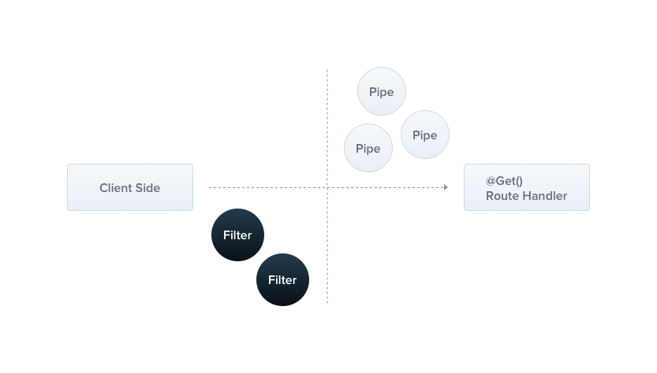

---
group:
  title: Overview
order: 6
---

# Exception filters

Nest provides a built-in exception layer responsible for handling all unhandled exceptions in the application. When an exception is not handled in the application code, it is caught by this layer, and then the layer automatically sends an appropriate user-friendly response.



By default, this operation is carried out by the built-in global exception filter, which handles exceptions of type `HttpException` (and its subclasses). When an exception is not recognized (neither an `HttpException` nor a class inheriting from `HttpException`), the built-in exception filter generates the following default JSON response:

```json
{
  "statusCode": 500,
  "message": "Internal server error"
}
```

## Throwing Exceptions

`Nest` provides a built-in `HttpException` class, exposed from the `@nestjs` package. For typical HTTP REST API-based applications, it is considered best practice to send standard HTTP response objects when certain error conditions occur.

For example, in the `CatsController`, we have a `findAll()` method (a `GET` route handler). Let's assume that this route handler throws an exception for some reason. To illustrate this, we hardcode it as follows:

```typescript
import { ForbiddenException } from "@nest";

@Get("/")
findAll() {
  throw new ForbiddenException("Forbidden");
}
```

When the client calls this API, the response looks like this:

```json
{
  "statusCode": 403,
  "message": "Forbidden"
}
```

The `ForbiddenException` here inherits from `HttpException`.

The constructor for `HttpException` takes two required parameters to determine the response:

- The `response` parameter defines the JSON response body. It can be a string or an object.
- The `status` parameter defines the [HTTP status code](https://developer.mozilla.org/en-US/docs/Web/HTTP/Status).

By default, the JSON response body contains two properties:

- `statusCode`: Defaults to the provided HTTP status code in the parameters.
- `message`: A brief description based on the HTTP error.

To only override the message part of the JSON response body, provide a string in the `response` parameter. To override the entire JSON response body, pass an object in the `response` parameter. Nest will serialize that object and return it as the JSON response body.

The second constructor parameter (`status`) should be a valid HTTP status code. It is considered best practice to use standard exception classes exported by `@nestjs`, such as the `ForbiddenException` mentioned above.

There is also a third constructor parameter (optional, `cause`) available to provide an [error cause](https://nodejs.org/en/blog/release/v16.9.0/#error-cause). The `cause` object will not be serialized into the response object, but it can be useful for logging purposes, providing valuable information about the internal error that caused the exception.

Here is an example that overrides the entire response body and provides an error cause:

```typescript
@Get('')
async findAll() {
  try {
    await this.service.findAll()
  } catch (error) { 
    throw new HttpException({
      status: HttpStatus.FORBIDDEN,
      error: 'This is a custom message',
    }, HttpStatus.FORBIDDEN, {
      cause: error
    });
  }
}
```

Continuing the translation:

The obtained response looks like this:

```json
{
  "status": 403,
  "error": "This is a custom message"
}
```

## Built-in HTTP Exception Classes

Nest provides a set of standard exceptions that inherit from the base `HttpException`. They come from the `@nestjs` package and represent many common HTTP exceptions.

- `BadRequestException`
- `BodyParamValidationException` (similar to `BadRequestException`, with a status code of 400)
- `UnauthorizedException`
- `NotFoundException`
- `ForbiddenException`
- `NotAcceptableException`
- `RequestTimeoutException`
- `ConflictException`
- `GoneException`
- `HttpVersionNotSupportedException`
- `PayloadTooLargeException`
- `UnsupportedMediaTypeException`
- `UnprocessableEntityException`
- `InternalServerErrorException`
- `NotImplementedException`
- `ImATeapotException`
- `MethodNotAllowedException`
- `BadGatewayException`
- `ServiceUnavailableException`
- `GatewayTimeoutException`
- `PreconditionFailedException`

All built-in exceptions can also provide error causes and descriptions using optional parameters:

```typescript
throw new BadRequestException(
  "Something bad happened",
  "Some error description",
  new Error("this is an error"),
);
```

With the above content, the response looks like this:

```json
{
  "statusCode": 400,
  "message": "Something bad happened",
  "error": "Some error description"
}
```

## Exception Filters

While basic (built-in) exception filters can automatically handle many cases, you might want full control over the exception layer. For example, you may want to add logging or use different JSON schemas based on certain dynamic factors. Exception filters are designed for this purpose. They allow you to have precise control over the control flow and the response content sent back to the client.

Let's create an exception filter responsible for catching exceptions belonging to the `HttpException` class and implementing custom response logic for them.

```typescript
import { Catch, Context, ExceptionFilter, HttpException } from "@nest";

@Catch(HttpException)
export class HttpExceptionFilter implements ExceptionFilter {
  catch(exception: HttpException, context: Context) {
    context.response.status = exception.status;
    context.response.body = {
      statusCode: exception.status,
      timestamp: new Date().toISOString(),
      path: context.request.url,
      type: "HttpExceptionFilter",
      message: exception.message,
    };
  }
}
```

All exception filters should implement the generic `ExceptionFilter<T>` interface. This requires you to provide a `catch(exception: T, context: Context)` method with a specified signature. Here, `T` represents the type of the exception.

The `@Catch(HttpException)` decorator binds the required metadata to the exception filter, informing Nest that this specific filter only handles exceptions of the type `HttpException` and not other exceptions. The `@Catch()` decorator can accept one parameter or a comma-separated list, allowing you to set up filters for multiple types of exceptions simultaneously.

## Binding the Filter

Let's bind our new `HttpExceptionFilter` to the `create()` method of the `CatsController`.

```typescript
import { UseFilters } from "@nest";

@Post('')
@UseFilters(new HttpExceptionFilter())
async create(@Body() createCatDto: CreateCatDto) {
  throw new ForbiddenException();
}
```

Here, we use the `@UseFilters()` decorator. Similar to the `@Catch()` decorator, it can accept a single filter instance or a comma-separated list of filter instances. In this case, we create an instance of the `HttpExceptionFilter`.

Alternatively, you can pass a class (rather than an instance), delegating the responsibility of instantiation to the framework and enabling dependency injection.

```typescript
@Post('')
@UseFilters(HttpExceptionFilter)
async create(@Body() createCatDto: CreateCatDto) {
  throw new ForbiddenException();
}
```

:::info
It's recommended to use classes to apply filters whenever possible, rather than instances. This can reduce memory usage as Nest can easily reuse the same instance of a class across the entire module.
:::

In the example above, the `HttpExceptionFilter` is applied only to the individual `create()` route handler, making it method-scoped. Exception filters can be scoped at different levels: method scope of a controller, global scope of a controller, or global scope of the application.

For instance, to set a filter at the controller scope, you can do the following:

```typescript
@UseFilters(new HttpExceptionFilter())
export class CatsController {}
```

To make it globally scoped, you can do the following:

```typescript
const app = await NestFactory.create(AppModule, Router);
app.useGlobalFilters(HttpExceptionFilter);
app.listen({ port: 8000 });
```

A globally scoped filter will be used throughout the entire application, applying to every controller and route handler. Regarding dependency injection, globally registered filters from outside any module context (like in the example with `useGlobalFilters()`) cannot inject dependencies because this is done outside the context of any module.

To address this issue, you can directly register globally scoped filters from any module using the following structure:

```typescript
import { Module, APP_FILTER } from '@nest';

@Module({
  providers: [
    {
      provide: APP_FILTER,
      useClass: HttpExceptionFilter,
    },
  ],
})
export class AppModule {}
```

:::warning
When using this approach for dependency injection of filters, be aware that, no matter where you use this construction, the filter is essentially global. Where should you perform such operations? Choose the module where the filter (e.g., `HttpExceptionFilter` in the example above) is defined.

Also, `useClass` is not the only way to handle custom provider registration. Learn more in the [Custom Provider](./11_custom_provider) section.
:::

You can use this technique to add any number of filters; just add each filter to the `providers` array.

## Catching All Exceptions

To catch every unhandled exception, regardless of the exception type, leave the parameter list of the `@Catch()` decorator empty, like `@Catch()`.

```typescript
import { Catch, Context, ExceptionFilter, HttpException } from "@nest";

@Catch()
export class AllExceptionsFilter implements ExceptionFilter {
  catch(exception: unknown, context: Context) {
    context.response.body = {
      statusCode: (exception as HttpException).status || 500,
      timestamp: new Date().toISOString(),
      path: context.request.url,
      type: "AllExceptionsFilter",
      error: (exception as Error).message,
    };
  }
}
```

:::info
When combining a catch-all exception filter with one bound to a specific type, it's advisable to declare the "catch-all" filter first to ensure that the specific filter correctly handles the bound type.
:::
