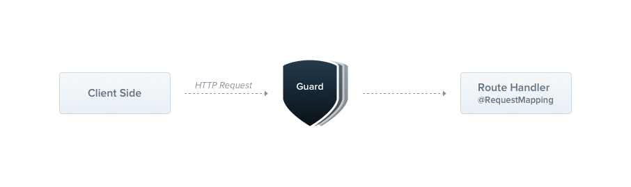

---
group:
  title: Overview
order: 7
---

# Guard

A Guard is a class with the `@Injectable()` decorator that implements the `CanActivate` interface.



Guards have a single responsibility. They determine whether a given request will be handled by the route handler based on specific conditions (such as permissions, roles, ACL, etc.) present at runtime. This is commonly referred to as authorization.

In traditional Express, Koa, and even in applications like Deno with Oak and Hono, authorization (and its often-collaborating authentication) is typically handled by middleware. Middleware is a good choice for authentication because things like token validation and attaching properties to the request object don't have a strong connection to the specific route context (and its metadata).

However, middleware is inherently unaware. It doesn't know which handler will be executed after calling the `next()` function. The design of Guards, like Exception Filters and Interceptors, allows you to insert processing logic at precise moments in the request/response cycle and implement it in a declarative way. This helps keep the code clean and declarative.

:::info
Guards execute after all middleware but before any interceptors (see the next chapter, [Interceptors](./08_interceptors)).
:::

## Authorization Guard

As mentioned, authorization is a good use case for Guards because specific routes should only be available when the caller (typically a specific authenticated user) has sufficient permissions.

The `RolesGuard` we're about to build assumes an authenticated user (hence a token attached to the request header). It will extract and validate the token, using the extracted information to determine whether the request can proceed.

```typescript
import { type CanActivate, type Context, Injectable } from "@nest";

@Injectable()
export class RolesGuard implements CanActivate {
  async canActivate(context: Context): Promise<boolean> {
    return true;
  }
}
```

Each Guard needs to implement the `CanActivate` interface, and the response result of the `canActivate` method determines whether the Guard allows or denies the passage. If it returns true, it means permission is granted; otherwise, it rejects.

Similar to Exception Filters, Guards can be controller-scoped, method-scoped, or globally scoped. Below, we set up a controller-scoped Guard using the `@UseGuards()` decorator. This decorator can accept a single parameter or a comma-separated list, making it easy to use a declarative set of Guards.

```typescript
import { UseGuards } from "@nest";

@Controller('cats')
@UseGuards(RolesGuard)
export class CatsController {}
```

Above, we pass the `RolesGuard` class (instead of an instance), leaving the instantiation responsibility to the framework and enabling dependency injection. Like with pipes and exception filters, we can also pass an instance.

```typescript
@Controller('cats')
@UseGuards(new RolesGuard())
export class CatsController {}
```

The above construction attaches the Guard to every handler declared by this controller. If we want the Guard to apply only to a single method, we apply the `@UseGuards()` decorator at the method level.

To set up a global Guard, use the `useGlobalGuards()` method of the Nest application instance.

```typescript
const app = await NestFactory.create(AppModule, HonoRouter);
app.useGlobalGuards(RolesGuard);
```

A globally scoped Guard will be used throughout the entire application, applying to every controller and route handler. In terms of dependency injection, globally registered Guards from outside any module context (such as in the example with `useGlobalGuards()`) cannot inject dependencies because this is done outside the context of any module.

To address this issue, you can directly set up Guards globally from any module using the following structure:

```typescript
import { Module, APP_GUARD } from '@nest';

@Module({
  providers: [
    {
      provide: APP_GUARD,
      useClass: RolesGuard,
    },
  ],
})
export class AppModule {}
```

:::warning
When using this approach for dependency injection of Guards, be aware that, no matter where you use this construction, the Guard is essentially global.

Also, `useClass` is not the only way to handle custom provider registration. Learn more in the [Custom Provider](./11_custom_provider) section.
:::

## Assigning Roles to Handlers

Our `RolesGuard` is working, but it's not yet intelligent enough. We haven't utilized the most crucial Guard feature - execution context. It still doesn't know about roles, or which roles each handler allows. For example, the `CatsController` might have different permission schemes for different routes. Some might be restricted to admin users, while others might be open to everyone.

How do we match roles with routes in a flexible and reusable way?

This is where custom metadata comes into play. Nest provides the built-in `@SetMetadata()` decorator through which custom metadata can be attached to route handlers. For example:

```typescript
import { SetMetadata } from "@nest";

export type Role = "admin" | "normal";

export const Roles = (...roles: Role[]) => SetMetadata("roles", roles);
```

Now, to use this decorator, we only need to annotate it with our handlers:

```typescript
@Post("")
@Roles(['admin'])
async create(@Body() createCatDto: CreateCatDto) {
  this.catsService.create(createCatDto);
}
```

Here, we attach the `Roles` decorator metadata to the `create()` method, indicating that only users with the admin role can access this route.

## Bringing It All Together

Now let's go back and integrate all of this with our `RolesGuard`. Currently, it just returns true in all cases, allowing every request to proceed. We want it to conditionally return based on the actual roles assigned to the current user and the roles required by the currently processed route.

To access the roles of a route (custom metadata), we will use the `Reflector` utility class, as shown below:

```typescript
import {
  type CanActivate,
  type Context,
  Injectable,
  Reflector,
} from "@nest";

@Injectable()
export class AuthGuard implements CanActivate {
  constructor(private reflector: Reflector) {}

  async canActivate(context: Context): Promise<boolean> {
    const roles = this.reflector.get<string[]>("roles", context);
    if (!roles) {
      return true;
    }
    const user = context.request.states.user;
    return matchRoles(roles, user.roles);
  }
}
```

You can also use the `getMetadataForGuard` raw function to get roles:

```typescript
import {
  type CanActivate,
  type Context,
  getMetadataForGuard,
  Injectable
} from "@nest";

@Injectable()
export class AuthGuard implements CanActivate {
  async canActivate(context: Context): Promise<boolean> {
    const roles = getMetadataForGuard<string[]>("roles", context);
    if (!roles) {
      return true;
    }
    const user = context.request.states.user;
    return matchRoles(roles, user.roles);
  }
}
```

Attaching the authorized user to the request object is a common practice. Therefore, in the example code above, we assume that `context.request.states.user` contains the user instance and allowed roles. Generally, if a Guard needs to fetch user information, it typically injects it into `request.states` so that subsequent steps can use the user information directly.

```typescript
const userInfo

 = await fetch("https://sso.xxx");
context.request.states.user = userInfo;
```

:::info
Later sections on decorators will explore how to elegantly use the user information injected here.
:::

## Guard Failure Response

When a user is denied by a `Guard` after requesting an endpoint, the framework responds with a default JSON:

```json
{
  "statusCode": 403,
  "message": "Forbidden resource",
  "error": "Forbidden"
}
```

This is because, behind the scenes, when a Guard returns false, the framework throws a `ForbiddenException` exception with a status code of 403.

If you want to return a different error response, you should throw your specific exception. For example:

```typescript
throw new UnauthorizedException();
```

:::info
Any exception thrown by a Guard will be handled by the exception layer (global exception filters and any exception filters applied to the current context).
:::
