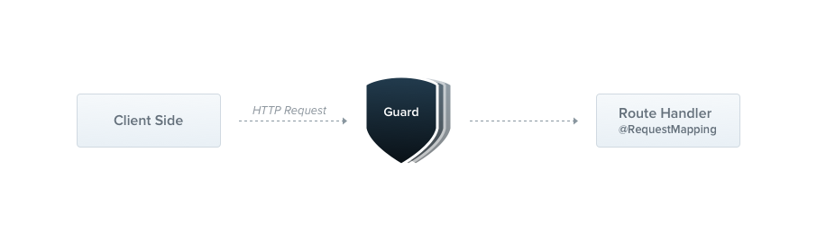

---
group:
  title: 概述
order: 7
---

# 守卫

Guard（守卫）是一个带有`@Injectable()`装饰符的类，它实现 `CanActivate` 接口。



守卫有一个单一的责任。它们根据运行时存在的特定条件（如权限、角色、ACL等）确定一个给定请求是否将由路由处理程序处理。这通常被称为授权。

在传统的Express、Koa乃至Deno的oak与hono等应用程序中，授权（以及它通常协作的身份验证）通常由中间件处理。
中间件对于身份验证来说是一个很好的选择，因为诸如令牌验证和将属性附加到请求对象之类的事情与特定的路由上下文（及其元数据）没有强烈的联系。

但是，中间件本质上是愚蠢的。它不知道在调用`next()`函数后将执行哪个处理程序。守卫的设计，就像异常过滤器和拦截器一样，允许你在**请求/响应**周期的准确时机插入处理逻辑，并以声明性方式实现。这有助于保持代码干净和声明性。

:::info
守卫在所有中间件之后执行，但在任何拦截器（详见下章《[Interceptors](./08_interceptors)》）之前执行。
:::

## 授权守卫

正如提到的那样，授权是守卫的一个很好的用例，因为特定的路由应该只在调用者（通常是特定的已认证用户）具有足够权限时可用。

我们现在要构建的 AuthGuard 假定有一个已认证的用户（因此请求标头中附加了令牌）。它将提取和验证令牌，并使用提取的信息来确定请求是否可以继续。

```typescript
import { type CanActivate, type Context, Injectable } from "@nest";

@Injectable()
export class RolesGuard implements CanActivate {
  async canActivate(context: Context): Promise<boolean> {
    return true;
  }
}
```

每个Guard都需要实现`CanActivate`接口，而`canActivate`方法的响应结果，决定了这个Guard是否放行，如果返回true，则表示允许，否则将拒绝。

像异常过滤器一样，守卫可以是控制器范围、方法范围或全局范围的。下面，我们使用`@UseGuards()`装饰器设置一个控制器范围的守卫。这个装饰器可以接受一个参数，也可以是逗号分隔的参数列表。这让你可以轻松地使用一个声明应用适当的守卫集合。

```typescript
import { UseGuards} from "@nest";

@Controller('cats')
@UseGuards(RolesGuard)
export class CatsController {}
```

以上，我们传递了RolesGuard类（而不是实例），将实例化的责任留给了框架并启用了依赖注入。与管道和异常过滤器一样，我们也可以传递一个实例。

```typescript
@Controller('cats')
@UseGuards(new RolesGuard())
export class CatsController {}
```

上面的构造将守卫附加到此控制器声明的每个处理程序上。如果我们希望守卫仅适用于单个方法，则在方法级别应用`@UseGuards()`装饰器。

要设置全局守卫，请使用Nest应用程序实例的`useGlobalGuards()`方法。

```typescript
const app = await NestFactory.create(AppModule, HonoRouter);
app.useGlobalGuards(RolesGuard);
```

全局守卫在整个应用程序中使用，用于每个控制器和每个路由处理程序。在依赖注入方面，从任何模块外部注册的全局守卫（如上面的示例中的`useGlobalGuards()`）无法注入依赖项，因为这是在任何模块的上下文之外进行的。为了解决这个问题，你可以使用以下结构从任何模块直接设置守卫：

```typescript
import { Module, APP_GUARD } from '@nest';

@Module({
  providers: [
    {
      provide: APP_GUARD,
      useClass: RolesGuard,
    },
  ],
})
export class AppModule {}
```

:::info
使用这种方法来执行守卫的依赖注入时，请注意无论在哪个模块中使用此构造，守卫实际上都是全局的。
 
此外，useClass并不是处理自定义提供程序注册的唯一方法。在[这里](./11_custom_provider)了解更多。
:::

## 按处理程序设置角色

我们的`RolesGuard`正在工作，但它还不够智能。我们尚未利用最重要的守卫功能 - 执行上下文。它还不知道角色，或者每个处理程序允许哪些角色。例如，`CatsController`可以针对不同的路由具有不同的权限方案。有些可能仅适用于管理员用户，而其他人则可以向所有人开放。

我们如何以灵活和可重用的方式将角色与路由匹配？

这就是自定义元数据发挥作用的地方。Nest提供了内置的`@SetMetadata()`装饰器，通过它们可以将自定义元数据附加到路由处理程序。例如：

```typescript
import { SetMetadata } from "@nest";

export type Role = "admin" | "normal";

export const Roles = (...roles: Role[]) => SetMetadata("roles", roles);
```

现在，要使用这个修饰符，我们只需要用它对处理程序进行注释:

```typescript
@Post("")
@Roles(['admin'])
async create(@Body() createCatDto: CreateCatDto) {
  this.catsService.create(createCatDto);
}
```

在这里，我们将Roles装饰器元数据附加到`create()`方法上，表示只有具有管理员角色的用户才能访问此路由。

## 将所有内容整合在一起

现在让我们回过头来将这一切与我们的`RolesGuard`结合起来。目前，它只是在所有情况下返回true，允许每个请求继续进行。我们希望根据当前用户分配的角色与当前处理的路由所需的实际角色进行条件返回值。

为了访问路由的角色（自定义元数据），我们将使用`Reflector`辅助类，如下所示：

```typescript
import {
  type CanActivate,
  type Context,
  Injectable,
  Reflector,
} from "@nest";

@Injectable()
export class AuthGuard implements CanActivate {
  constructor(private reflector: Reflector) {}

  async canActivate(context: Context): Promise<boolean> {
    const roles = this.reflector.get<string[]>("roles", context);
    if (!roles) {
      return true;
    }
    const user = context.request.states.user;
    return matchRoles(roles, user.roles);
  }
}
```

也可以使用`getMetadataForGuard`这个原始函数来获取roles：

```typescript
import {
  type CanActivate,
  type Context,
  getMetadataForGuard,
  Injectable
} from "@nest";

@Injectable()
export class AuthGuard implements CanActivate {
  async canActivate(context: Context): Promise<boolean> {
    const roles = getMetadataForGuard<string[]>("roles", context);
    if (!roles) {
      return true;
    }
    const user = context.request.states.user;
    return matchRoles(roles, user.roles);
  }
}
```

将授权用户附加到请求对象是一种常见做法。因此，在上面的示例代码中，我们假设`context.request.states.user`包含用户实例和允许的角色。一般来说，`Guard`如果需要获取用户信息，则通常会将它注入到`request.states`中，以便后面的步骤可以直接使用用户信息。

```typescript
const userInfo = await fetch("https://sso.xxx");
context.request.states.user = userInfo;
```

:::info
后面装饰器的章节会介绍如何优雅地使用这里注入的用户信息。
:::

## 守卫失败响应

当用户请求了接口后被`Guard`拒绝，会默认响应一个JSON：

```json
{
  "statusCode": 403,
  "message": "Forbidden resource",
  "error": "Forbidden"
}
```

这是因为，在幕后，当一个守卫返回 false 时，框架会抛出一个 `ForbiddenException` 异常，状态码为403。

如果你想返回一个不同的错误响应，你应该抛出自己特定的异常。例如：

```typescript
throw new UnauthorizedException();
```

:::info
任何由守卫抛出的异常都将由异常层处理（全局异常过滤器和应用于当前上下文的任何异常过滤器）。
:::
