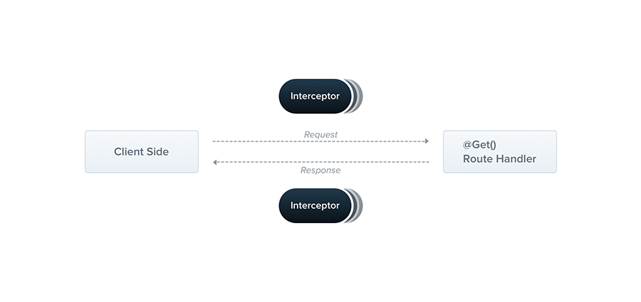

---
group:
  title: Overview
order: 8
---

# Interceptor

`Interceptor` is a class with the `@Injectable()` decorator that implements the `NestInterceptor` interface.



Interceptors have a set of useful features inspired by Aspect-Oriented Programming (AOP) techniques. They make the following operations possible:

- Bind additional logic before/after method execution
- Transform results returned from functions
- Transform exceptions thrown from functions
- Extend basic function behavior
- Completely override functions based on specific conditions (e.g., for caching purposes)

## Basics

Each interceptor implements the `intercept()` method, which takes two parameters. The first parameter is an instance of `Context`, representing the execution context, and the second parameter is a `Next` function.

:::info
The ability of interceptors is similar to `Middleware`, but the difference is that the lifecycle of middleware spans the entire request-response, while interceptors come after `Guard`. In other words, if a request doesn't pass through `Guard` validation, it won't reach the interceptor.
:::

For example, consider an incoming `POST /cats` request. This request will be sent to the `create()` handler defined inside the `CatsController`. If the interceptor doesn't call `next()`, the `create()` method will not be executed, and the interceptor can independently modify the `Context` instance's response body and status.

Let's look at the first use case, which is logging user interactions (e.g., storing user calls, asynchronously dispatching events, or calculating timestamps). Here's a simple `LoggingInterceptor`:

```typescript
import { type Context, Injectable, type NestInterceptor, Next } from "@nest";

@Injectable()
export class LoggingInterceptor implements NestInterceptor {
  async intercept(ctx: Context, next: Next) {
    console.log("LoggingInterceptor", "Before...");
    await next();
    console.log("LoggingInterceptor", `After...`);
  }
}
```

## Applying Interceptors

To set up an interceptor, we use the `@UseInterceptors()` decorator imported from the `@nest` package. Like Guards and Exception Filters, interceptors can be controller-scoped, method-scoped, or globally scoped.

### Controller Scope

```typescript
@UseInterceptors(LoggingInterceptor)
export class CatsController {}
```

With the above construction, every route handler defined in `CatsController` will use the `LoggingInterceptor`. When someone calls the `GET /cats` endpoint, you'll see the following output in the standard output:

```bash
LoggingInterceptor Before...
LoggingInterceptor After...
```

Note that we pass the type `LoggingInterceptor` (instead of an instance), leaving the instantiation responsibility to the framework and enabling dependency injection. Like with guards and exception filters, we can also pass a ready-made instance:

```typescript
@UseInterceptors(new LoggingInterceptor())
export class CatsController {}
```

As mentioned, the above construction attaches the interceptor to every handler declared by this controller.

### Method Scope

If we want to limit the scope of the interceptor to a single method, we can apply the decorator at the method level.

```typescript
export class CatsController {
  @UseInterceptors(LoggingInterceptor)
  @Get("/")
  hello() {}
}
```

### Global Scope

To set up a global interceptor, we use the `useGlobalInterceptors()` method of the Nest application instance:

```typescript
const app = await NestFactory.create(AppModule, Router);
app.useGlobalInterceptors(LoggingInterceptor);
```

Or using an instance:

```typescript
const app = await NestFactory.create(AppModule, Router);
app.useGlobalInterceptors(new LoggingInterceptor());
```

A globally scoped interceptor will be used throughout the entire application, applying to every controller and route handler. In terms of dependency injection, globally registered interceptors from outside any module context (such as in the example with `useGlobalInterceptors()`) cannot inject dependencies because this is done outside the context of any module.

To address this issue, you can use the following structure to set up interceptors directly from any module:

```typescript
import { APP_INTERCEPTOR, Module } from "@nest";
import { LoggingInterceptor } from "./interceptor.ts";

@Module({
  providers: [
    {
      provide: APP_INTERCEPTOR,
      useClass: LoggingInterceptor,
    },
  ],
})
export class AppModule {}
```

:::info
When using this approach for dependency injection of interceptors, be aware that, no matter where you use this construction, the interceptor is essentially global. It should be done in the module defining the interceptor (like the `LoggingInterceptor` above). Also, `useClass` is not the only way to handle custom provider registration.

Learn more in the [Custom Provider](./11_custom_provider.en-US.md) section.
:::

## Modifying Response

In the above example, we only printed simple messages before and after the execution of the route handler. However, interceptors can also easily modify the response result:

```typescript
import { type Context, Injectable, type NestInterceptor, Next } from "@nest";

@Injectable()
export class LoggingInterceptor implements NestInterceptor {
  async intercept(ctx: Context, next: Next) {
    console.log("LoggingInterceptor", "Before...");
    const start = Date.now();
    await next();
    console.log("LoggingInterceptor", `After...`);
    const ms = Date.now() - start;
    ctx.response.headers.set("X-Response-Time", `${ms}ms`);
    ctx.response.body = {
      success: true,
      data: ctx.response.body,
    };
  }
}
```

In this case, when a user calls `GET /cats` again, besides seeing the result in the standard output, they will also see a change in the response result:

```json
{
	"success": true,
	"data": "Hello World!"
}
```

You can also see an additional header `X-Response-Time` in the response headers:


## Exception Handling

Interceptors can also handle exceptions thrown by route handlers. For example, after obtaining exception information, an `HttpException` can be thrown:

```typescript
@Injectable()
export class ErrorsInterceptor implements NestInterceptor {
  async intercept(context: Context, next: Next) {
    try {
      await next();
    } catch (error) {
      throw new BadGatewayException("");
    }
  }
}
```

We add a new endpoint `/err` to the `AppController`,

 which throws an error message and uses the `ErrorsInterceptor`:

```typescript
@Controller("")
export class AppController {
  @Get("/err")
  @UseInterceptors(ErrorsInterceptor)
  err() {
    throw new Error("error");
  }
}
```

Now, when a user requests `GET /err`, they will get the following response:

```json
{
  "statusCode": 502,
  "message": "Bad Gateway"
}
```

This response is the result of being handled by the globally default Exception Filter.

It's worth noting that once an interceptor throws an exception, it will interrupt the handler, and it won't flow to the next interceptor. Therefore, in this example, if the `LoggingInterceptor` is already globally used, you'll only see one print statement:

```bash
LoggingInterceptor Before...
```

:::warning
The above is used only as an example. For exception handling, it is recommended to use Exception Filters.
:::

## Cache Interceptor

A common use case for interceptors is a cache interceptor.

```typescript
@Injectable()
export class CacheInterceptor implements NestInterceptor {
  // deno-lint-ignore no-explicit-any
  map: Map<string, any> = new Map();

  async intercept(context: Context, next: Next) {
    if (context.request.method !== "GET") {
      return next();
    }
    const url = context.request.url;
    const isCached = this.map.has(url);
    if (isCached) {
      context.response.body = this.map.get(url);
      return;
    }
    await next();
    this.map.set(url, context.response.body);
  }
}
```

## Difference from Middleware

`Interceptor` is similar to middleware in that both are aspect-oriented features of Nest programs.

The differences between the two are:

1. The lifecycle of `Interceptor` is after `Guard`, so it cannot intercept the processing of `Guard`. Middleware, on the other hand, spans the entire request lifecycle.
2. `Interceptor` can be registered as a global module using dependency injection, while middleware currently has limited functionality.
3. Route 404 exceptions do not enter `Interceptor`, but they do enter middleware (and Exception Filters).

Because of their similarities, `Nest` intentionally weakens the capabilities of middleware and recommends developers use `Interceptor` directly.

As the lifecycle of `Interceptor` is shorter than that of `Guard`, `Nest` injects a `startTime` property into the `Request`, allowing developers to obtain processing time close to middleware:

```typescript
@Injectable()
export class LoggingInterceptor implements NestInterceptor {
  async intercept(ctx: Context, next: Next) {
    console.log("LoggingInterceptor", "Before...");
    await next();
    console.log("LoggingInterceptor", `After...`);
    const ms = Date.now() - ctx.request.startTime;
    ctx.response.headers.set("X-Response-Time", `${ms}ms`);
  }
}
```
