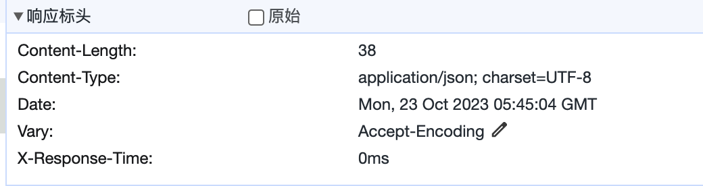

---
group:
  title: 概述
order: 8
---

# 拦截器

`Interceptor`（拦截器）是一个带有`@Injectable()`修饰符的类，它实现了`NestInterceptor` 接口。


拦截器具有一组有用的功能，受到面向切面编程（AOP）技术的启发。它们使得以下操作成为可能：

- 在方法执行前/后绑定额外逻辑
- 转换从函数返回的结果
- 转换从函数抛出的异常
- 扩展基本函数行为
- 根据特定条件完全覆盖函数（例如，用于缓存目的）

## 基础信息

每个拦截器都实现了`intercept()`方法，该方法接受两个参数。第一个参数是`Context`实例，也就是执行上下文；第二个参数是`Next`函数。

:::info
拦截器的能力，与`Middleware`（中间件）类似，区别在于中间件的生命周期贯穿整个请求响应，而拦截器则在`Guard`之后。也就是说，如果请求没有通过`Guard`校验，则不会到达拦截器。
:::

例如，考虑一个传入的`POST /cats`请求。此请求将发送到`CatsController`内定义的`create()`处理程序。如果拦截器不调用`next()`，那么`create()`方法将不会被执行，拦截器可以自行修改`Context`实例的响应 Body 与 Status。

我们将看一下第一个使用案例，即使用拦截器记录用户交互（例如存储用户调用、异步分派事件或计算时间戳）。下面是一个简单的`LoggingInterceptor`：

```typescript
import {
  type Context,
  Injectable,
  type NestInterceptor,
  Next,
} from '@nest/core';

@Injectable()
export class LoggingInterceptor implements NestInterceptor {
  async intercept(ctx: Context, next: Next) {
    console.log('LoggingInterceptor', 'Before...');
    await next();
    console.log('LoggingInterceptor', `After...`);
  }
}
```

## 绑定拦截器

为了设置拦截器，我们使用从`@nest/core`包导入的`@UseInterceptors()`装饰器。与 Guard、Exception Filter 一样，拦截器可以是控制器范围、方法范围或全局范围的。

### 控制器范围

```typescript
@UseInterceptors(LoggingInterceptor)
export class CatsController {}
```

使用上述构建，`CatsController` 中定义的每个路由处理程序都将使用 `LoggingInterceptor`。当有人调用 `GET /cats` 端点时，将在标准输出中看到以下输出：

```bash
LoggingInterceptor Before...
LoggingInterceptor After...
```

请注意，我们传递了`LoggingInterceptor`类型（而不是实例），将实例化的责任留给框架，并启用依赖注入。与守卫和异常过滤器一样，我们也可以传递一个现成的实例：

```typescript
@UseInterceptors(new LoggingInterceptor())
export class CatsController {}
```

如上所述，上述构造将拦截器附加到该控制器声明的每个处理程序。

### 方法范围

如果我们想将拦截器的作用范围限制在单个方法中，只需在方法级别应用装饰器。

```typescript
export class CatsController {
  @UseInterceptors(LoggingInterceptor)
  @Get('/')
  hello() {}
}
```

### 全局范围

为了设置全局拦截器，我们使用`Nest`应用程序实例的`useGlobalInterceptors()`方法：

```typescript
const app = await NestFactory.create(AppModule, Router);
app.useGlobalInterceptors(LoggingInterceptor);
```

或者使用实例：

```typescript
const app = await NestFactory.create(AppModule, Router);
app.useGlobalInterceptors(new LoggingInterceptor());
```

全局拦截器在整个应用程序中使用，适用于每个控制器和每个路由处理程序。在依赖注入方面，从任何模块外部注册的全局拦截器（如上面的示例中使用的`useGlobalInterceptors()`）无法注入依赖项，因为这是在任何模块的上下文之外进行的。为了解决这个问题，你可以使用以下结构直接从任何模块设置拦截器：

```typescript
import { APP_INTERCEPTOR, Module } from '@nest/core';
import { LoggingInterceptor } from './interceptor.ts';

@Module({
  providers: [
    {
      provide: APP_INTERCEPTOR,
      useClass: LoggingInterceptor,
    },
  ],
})
export class AppModule {}
```

:::info
当使用这种方法为拦截器执行依赖注入时，请注意，无论在哪个模块中使用此构造，拦截器实际上都是全局的。应该在定义拦截器（例如上面的`LoggingInterceptor`）的模块中进行此操作。此外，`useClass`并不是处理自定义提供程序注册的唯一方式。在[这里](./11_custom_provider.md)了解更多信息。
:::

## 修改响应

上述样例，只是在路由处理程序执行前后简单地打印，拦截器也可以很容易修改响应的结果：

```typescript
import {
  type Context,
  Injectable,
  type NestInterceptor,
  Next,
} from '@nest/core';

@Injectable()
export class LoggingInterceptor implements NestInterceptor {
  async intercept(ctx: Context, next: Next) {
    console.log('LoggingInterceptor', 'Before...');
    const start = Date.now();
    await next();
    console.log('LoggingInterceptor', `After...`);
    const ms = Date.now() - start;
    ctx.response.headers.set('X-Response-Time', `${ms}ms`);
    ctx.response.body = {
      success: true,
      data: ctx.response.body,
    };
  }
}
```

这样的话，当用户再次调用 `GET /cats` 时，除了在标准输出中输出结果，也会看到响应结果的变化：

```json
{
  "success": true,
  "data": "Hello World!"
}
```

响应标头中也可以看到多了一个标头`X-Response-Time`：



## 异常拦截

拦截器同样也可以处理路由处理程序的异常。比如在获取到异常信息后，抛出一个`HttpException`：

```typescript
@Injectable()
export class ErrorsInterceptor implements NestInterceptor {
  async intercept(context: Context, next: Next) {
    try {
      await next();
    } catch (error) {
      throw new BadGatewayException('');
    }
  }
}
```

我们在`AppController`中新增一个接口`GET /err`，它抛出一个错误信息，且使用`ErrorsInterceptor`：

```typescript
@Controller('')
export class AppController {
  @Get('/err')
  @UseInterceptors(ErrorsInterceptor)
  err() {
    throw new Error('error');
  }
}
```

这样，当用户请求`GET /err`后，会得到响应：

```json
{
  "statusCode": 502,
  "message": "Bad Gateway"
}
```

这个响应是被全局默认的 Exception Filter 处理后的结果。

需要注意的是，一旦拦截器抛出了异常，那么就会中断处理程序，不会再流转到下一个拦截器，所以此例中如何已经全局使用了`LoggingInterceptor`，只会看到一句打印：

```bash
LoggingInterceptor Before...
```

:::warning
以上仅仅作为示例使用，对于异常的捕获，更推荐使用 Exception Filter 进行处理。
:::

## 缓存拦截器

拦截器一个常见的用法是缓存拦截器。

```typescript
@Injectable()
export class CacheInterceptor implements NestInterceptor {
  // deno-lint-ignore no-explicit-any
  map: Map<string, any> = new Map();

  async intercept(context: Context, next: Next) {
    if (context.request.method !== 'GET') {
      return next();
    }
    const url = context.request.url;
    const isCached = this.map.has(url);
    if (isCached) {
      context.response.body = this.map.get(url);
      return;
    }
    await next();
    this.map.set(url, context.response.body);
  }
}
```

## 与中间件的区别

`Interceptor`与中间件比较类似，都是 Nest 程序的切面功能。

二者的区别在于：

1. `Interceptor`的生命周期在`Guard`之后，无法拦截到`Guard`的处理；而中间件则贯穿整个请求的生命周期。
2. `Interceptor`可以注册为全局模块，使用`DI`依赖注入；而中间件目前只可使用简单的功能。
3. 路由 404 异常不会进入到`Interceptor`；而中间件可以（Exception filter 也可以）。

正因为二者的相似，所以`Nest`刻意削弱了中间件的能力，推荐开发者直接使用`Interceptor`。

由于`Interceptor`的生命周期短于`Guard`，`Nest`在`Request`中注入了一个属性`startTime`，开发者可以利用它得到与中间件相近的处理时间：

```typescript
@Injectable()
export class LoggingInterceptor implements NestInterceptor {
  async intercept(ctx: Context, next: Next) {
    console.log('LoggingInterceptor', 'Before...');
    await next();
    console.log('LoggingInterceptor', `After...`);
    const ms = Date.now() - ctx.request.startTime;
    ctx.response.headers.set('X-Response-Time', `${ms}ms`);
  }
}
```
