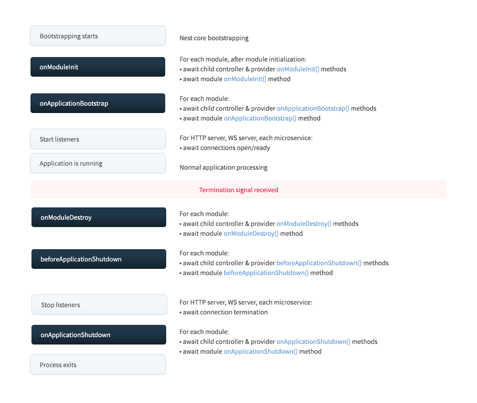

---
group:
  title: Fundamentals
  order: 2
order: 4
---

# Lifecycle Events

`Nest` applications, as well as each element of an application, have their lifecycles managed by Nest. Nest provides lifecycle hooks that allow you to observe critical lifecycle events and execute code registered on your modules, providers, or controllers when these events occur.

## Lifecycle Sequence

The diagram below illustrates the sequence of key application lifecycle events, from bootstrapping the application to the termination of the Deno process. The entire lifecycle can be divided into three phases: initialization, running, and termination. With this lifecycle, you can schedule appropriate module and service initialization, manage active connections, and gracefully shut down the application when a termination signal is received.



## Lifecycle Events

Lifecycle events occur during the startup and shutdown processes of the application. Nest calls the registered lifecycle hook methods on modules, providers, and controllers at each lifecycle event (assuming shutdown hooks are enabled, as described below). As shown in the diagram above, Nest also calls the appropriate underlying methods to start and stop listening for connections.

In the table below, only `onModuleDestroy`, `beforeApplicationShutdown`, and `onApplicationShutdown` are triggered if `app.close()` is explicitly called or if the process receives a special system signal (such as `SIGTERM`), and `enableShutdownHooks` was correctly called during application startup.

| Lifecycle Hook Method         | When the Hook Method is Called in the Lifecycle Event                                                                                                                                                         |
| ----------------------------- | ------------------------------------------------------------------------------------------------------------------------------------------------------------------------------------------------------------- |
| `onModuleInit`                | Called once after the dependencies of the hosting module have been resolved.                                                                                                                                  |
| `onApplicationBootstrap`      | Called once after all modules are initialized but before listening for connections.                                                                                                                           |
| `onModuleDestroy`\*           | Called after receiving a termination signal (e.g., `SIGTERM`).                                                                                                                                                |
| `beforeApplicationShutdown`\* | Called after all `onModuleDestroy()` handlers have completed (Promises resolved or rejected); once complete (Promises resolved or rejected), all existing connections will be closed (calling `app.close()`). |
| `onApplicationShutdown`\*     | Called after connections are closed (`app.close()` resolved).                                                                                                                                                 |

:::warning
`*` For these events to work with system signals (such as `SIGTERM`), you must explicitly call `app.close()` or choose to join them. See the Application Shutdown section below.

The execution order of `onModuleInit` and `onApplicationBootstrap` depends directly on the order of module imports, waiting for the previous hook to complete.
:::

## Usage

Each lifecycle hook is represented by an interface. The interfaces are technically optional, as they do not exist after TypeScript compilation. Nevertheless, it's a good practice to use them for the benefits of strong typing and editor tools.

To register a lifecycle hook, implement the corresponding interface. For example, to register a method during the module initialization phase of a specific class (e.g., Controller, Provider, or Module), implement the `OnModuleInit` interface and provide an `onModuleInit()` method, as shown below:

```typescript
import { Injectable, OnModuleInit } from '@nest/core';

@Injectable()
export class UsersService implements OnModuleInit {
  onModuleInit() {
    console.log(`The module has been initialized.`);
  }
}
```

## Application Shutdown

During the termination phase (in response to explicitly calling `app.close()` or receiving system signals such as `SIGTERM` if injected), the `onModuleDestroy()`, `beforeApplicationShutdown()`, and `onApplicationShutdown()` hooks will be called. This feature is commonly used in conjunction with `Kubernetes` to manage container lifecycles or with `Heroku` for dynos or similar services.

**Shutdown hook listeners** consume system resources, so they are disabled by default. To use shutdown hooks, you must call `enableShutdownHooks()`:

```typescript
const app = await NestFactory.create(AppModule, Router);
app.enableShutdownHooks();
await app.listen({
  port: 8000,
});
```

:::warning
Due to platform limitations, Nest only supports application shutdown hooks on Windows for `SIGINT` (`CTRL+C`) and `SIGBREAK` (`CTRL+Break`). However, since killing the process in Task Manager is unconditional, "there is no application that can detect or prevent it," so `SIGTERM` will never work on Windows.
:::

When the application receives a termination signal, it will call any registered `onModuleDestroy()`, `beforeApplicationShutdown(signal?: string)`, and `onApplicationShutdown(signal?: string)` methods (in the order described above). If registered functions await asynchronous calls (return a promise), Nest will not proceed with the sequence until the promise is resolved or rejected.

```typescript
@Injectable()
class UsersService implements OnApplicationShutdown {
  onApplicationShutdown(signal: string) {
    console.log(signal); // e.g., "SIGINT"
  }
}
```

:::warning
Calling `app.close()` does not terminate the Deno process; it only triggers the `onModuleDestroy()` and `onApplicationShutdown()` hooks. Therefore, if there are some intervals, long-running background tasks, etc., the process will not automatically terminate.
:::
