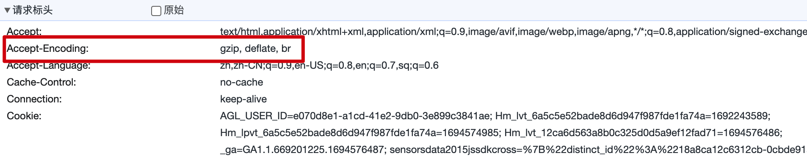

---
group:
  title: Techniques
  order: 3
order: 1
---

# Compression

Compression can significantly reduce the size of the response body, thereby improving the speed of a web application. Thanks to the default capabilities of `Deno`, `Nest` can enjoy compression without the need for additional configuration.

The compression in `Deno` primarily relies on automatically selecting the most suitable compression algorithm based on the content of the `Accept-Encoding` header in the request:

When multiple algorithms are available simultaneously, `Deno` selects the one with the highest compression efficiency, such as `br`:

