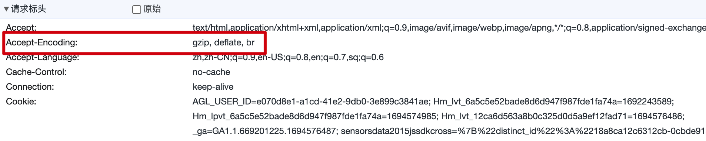
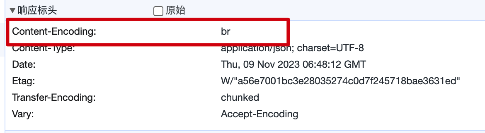

---
group:
  title: 技巧
  order: 3
order: 1
---

# 压缩

压缩可以大大减小响应体的大小，从而提高Web应用的速度。得益于`Deno`的默认功能，`Nest`不需要进行额外的配置就可以享受压缩的能力。

`Deno`的压缩主要根据请求标头中的`Accept-Encoding`的内容来自动选择最适合的压缩算法：

当这几个算法同时存在时，`Deno`会选择压缩效率最高的`br`：

