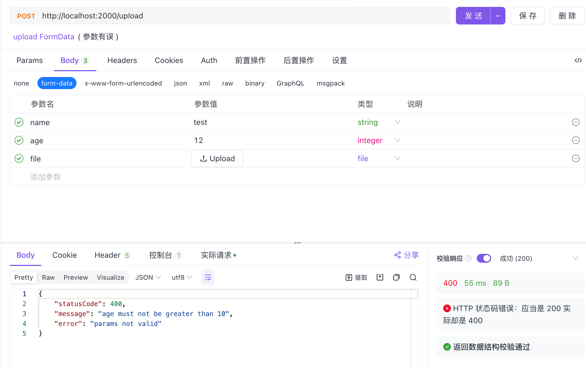

---
group:
  title: Tips
  order: 3
order: 2
---

# File Upload

File uploads are typically handled by our interfaces receiving `FormData` submissions from HTML5, as traditional form submissions do not include files.

`Nest` has built-in parameter decorators for `Form`, which can directly access the uploaded `FormData`:

```typescript
import { Controller, Form, Post } from "@nest";
import { UploadDto } from "./app.dto.ts";

@Controller("")
export class AppController {
  @Post("/upload")
  upload(
    @Form({
      maxFileSize: 10 * 1024 * 1024,
    }) result: UploadDto,
  ) {
    console.log(result);
    return "upload ok";
  }
}
```

Here, `UploadDto` is a `class`, consistent with our previous use of `class_validator` to validate normal `POST` parameters. One thing to note is the specificity of `Form`: its general parameters (excluding `File`) are received as strings by default. To convert them to numbers, use the `Property` decorator.

```typescript
import { IsNumber, IsString, Max } from "class_validator";
import { Property } from "@nest";

export class UploadDto {
  @IsString()
  name: string;

  @Property()
  @IsNumber()
  @Max(10)
  age: number;

  file: File;
}
```

In case of parameter errors, the interface throws an exception with a status code of 400:



When the file size exceeds the set `maxFileSize`, a similar error is reported:

```json
{
    "statusCode": 400,
    "message": "file size too large",
    "error": "params not valid"
}
```

When all parameters are correct, the output is as follows:

```json
{
  "name": "test",
  "age": 1,
  "file": {
    "name": "Xnip2023-06-09_18-49-40.png",
    "size": 1882844,
    "type": "image/png"
  }
}
```
