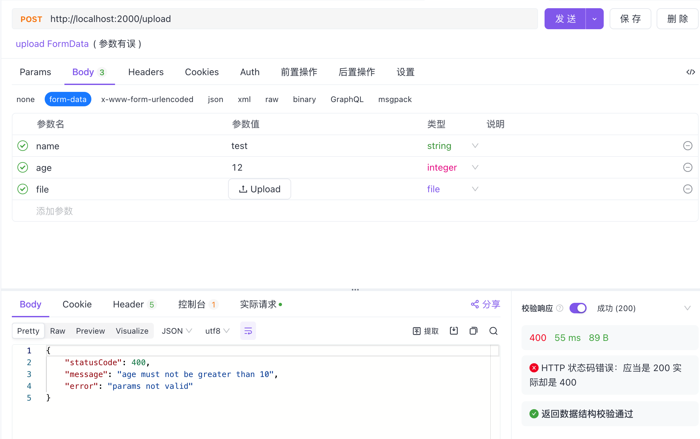

---
group:
  title: 技巧
  order: 3
order: 2
---

# 文件上传

文件上传通常来说是我们的接口接收H5的`FormData`提交，而传统的Form表单提交是不包含文件的。

`Nest`内置了`Form`的参数装饰器，可以直接获取到上传的`FormData`数据：

```typescript
import { Controller, Form, Post } from "@nest";
import { UploadDto } from "./app.dto.ts";

@Controller("")
export class AppController {
  @Post("/upload")
  upload(
    @Form({
      maxFileSize: 10 * 1024 * 1024,
    }) result: UploadDto,
  ) {
    console.log(result);
    return "upload ok";
  }
}
```

其中`UploadDto`是个`class`，与我们之前使用`class_validator`校验普通`POST`参数是一致的。值得注意的一点是，`Form`的特殊性，它的一般参数（除`File`外）默认得到的是字符串，要转换为数字需要使用`Property`装饰器。

```typescript
import { IsNumber, IsString, Max } from "class_validator";
import { Property } from "@nest";

export class UploadDto {
  @IsString()
  name: string;

  @Property()
  @IsNumber()
  @Max(10)
  age: number;

  file: File;
}
```

参数错误时接口会抛出状态码为400的异常：



当文件大小超出设置的`maxFileSize`时，也会同样报错：

```json
{
    "statusCode": 400,
    "message": "file size too large",
    "error": "params not valid"
}
```

当参数全部正常时打印如下：

```json
{
  name: "test",
  age: 1,
  file: File {
    name: "Xnip2023-06-09_18-49-40.png",
    size: 1882844,
    type: "image/png"
  }
}
```
