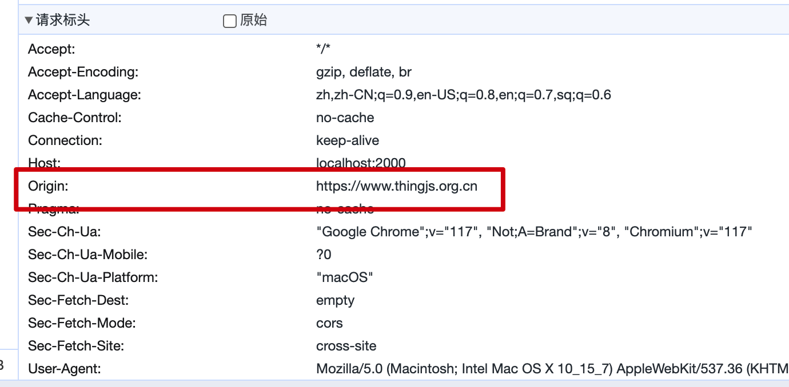

---
group:
  title: Tips
  order: 3
order: 6
---

# CORS

Cross-Origin Resource Sharing (`CORS`) is a mechanism that allows requesting resources from another domain. At its core, Nest provides a generic `@nest/cors` package to assist you in customization.

First, add the `importMap`:

```json
{
  "imports": {
    "@nest": "https://deno.land/x/deno_nest@v3.6.2/mod.ts",
    "@nest/hono": "https://deno.land/x/deno_nest@v3.6.2/modules/hono/mod.ts",
    "@nest/cors": "https://deno.land/x/deno_nest@v3.6.2/modules/cors/mod.ts",
    "hono/": "https://deno.land/x/hono@v3.9.1/"
  }
}
```

Start using it:

```typescript
import { NestFactory } from "@nest";
import { Router } from "@nest/hono";
import { CORS } from "@nest/cors";
import { AppModule } from "./app.module.ts";

const app = await NestFactory.create(AppModule, Router);
app.use(CORS());

await app.listen({
  port: 2000,
});
```

The `CORS` method takes an optional configuration object parameter:

```typescript
export function CORS(options?: boolean | CorsOptions) {}
  
export interface CorsOptions {
  /**
   * Configures the `Access-Control-Allow-Origins` CORS header.
   */
  origin?: StaticOrigin | CustomOrigin;
  /**
   * Configures the Access-Control-Allow-Methods CORS header.
   */
  methods?: string | string[];
  /**
   * Configures the Access-Control-Allow-Headers CORS header.
   */
  allowedHeaders?: string | string[];
  /**
   * Configures the Access-Control-Expose-Headers CORS header.
   */
  exposedHeaders?: string | string[];
  /**
   * Configures the Access-Control-Allow-Credentials CORS header.
   */
  credentials?: boolean;
  /**
   * Configures the Access-Control-Max-Age CORS header.
   */
  maxAge?: number;
  /**
   * Whether to pass the CORS preflight response to the next handler.
   */
  preflightContinue?: boolean;
  /**
   * Provides a status code to use for successful OPTIONS requests.
   */
  optionsSuccessStatus?: number;
}
```

By default, the `CORS` middleware reads the `Origin` property from the request:


And adds it to the response headers:


Each of the other options has its own explanation, but they are not overly complicated, so they won't be reiterated here.
