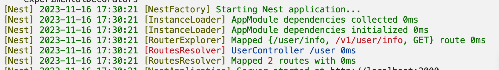
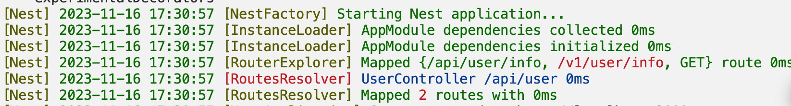
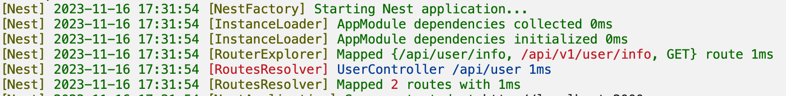
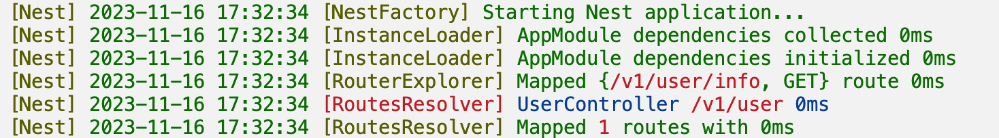
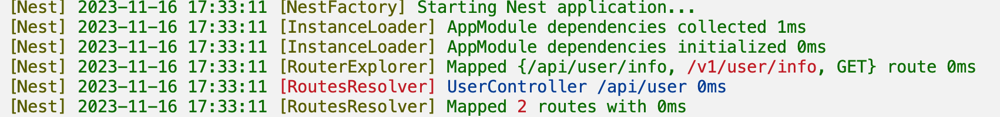
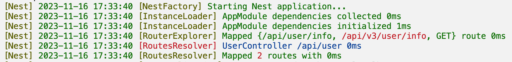
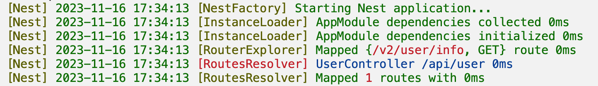
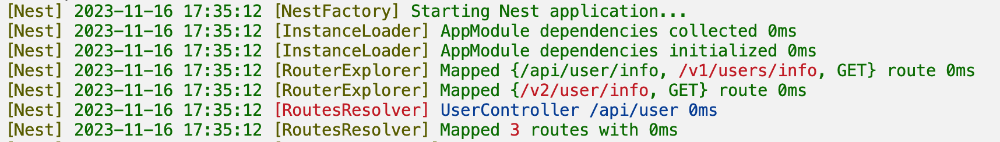

# Alias

Sometimes we need to manage the versions of APIs, and `Nest` provides an "alias" feature for this purpose.

## Controller Alias

### Without Prefix

For example, if you have a `user.controller.ts` file, you can add an `alias` parameter:

```typescript
@Controller('user', {
  alias: '/v1/user/',
})
export class UserController {
  @Get('/info')
  info() {
    return 'info';
  }
}
```

Now you have two APIs: `/user/info` and `/v1/user/info`. Each method has a twin brother.



### With Global Prefix

If you set a global API prefix:

```typescript
const app = await NestFactory.create(AppModule);
app.setGlobalPrefix('/api');
```

The APIs in the previous example will become: `/api/user/info` and `/v1/user/info`.



If you want your alias to also include the global prefix (`/api/v1/user/info`), you can use the `${prefix}/` template in the alias string:

```typescript
@Controller("user", {
  alias: "${prefix}/v1/user/",
})
```



Similarly, you can use the `${controller}` template string. The following code is equivalent:

```typescript
@Controller("user", {
  alias: "${prefix}/v1/${controller}",
})
```

### Using Alias Only

The previous cases generate two sets of APIs, but you may have a requirement where only this `Controller`'s APIs do not start with the global `prefix`, and only one set of APIs is needed. In this case, you can use the `isAliasOnly` option:

```typescript
@Controller("/v1/user", {
  isAliasOnly: true,
})
```



It is equivalent to the following code:

```typescript
@Controller("abcd", {
  alias: "/v1/user",
  isAliasOnly: true,
})
```

## Method Alias

```typescript
@Controller('/user')
export class UserController {
  @Get('/info', {
    alias: '/v1/user/info',
  })
  info() {}
}
```

Now you will get two APIs: `/user/info` and `/v1/user/info`.



### Using Template

The `${prefix}` and `${controller}` template strings work in methods as well, and there is also a method name `${method}`:

```typescript
@Controller('/user')
export class UserController {
  @Get('/info', {
    alias: '${prefix}/v3/${controller}/${method}',
  })
  info() {}
}
```



### Using Alias Only

`isAliasOnly` also works:

```typescript
@Controller('/user')
export class UserController {
  @Get('/v2/user/info', {
    isAliasOnly: true,
  })
  info() {}
}
```



Now only one API `/v2/user/info` is generated, even if the `Controller` also has an alias set:

```typescript
@Controller('/user', { alias: '/v1/users' })
export class UserController {
  @Get('/v2/user/info', {
    isAliasOnly: true,
  })
  info() {}
}
```

If it is as follows:

```typescript
@Controller('/user', { alias: '/v1/users' })
export class UserController {
  @Get('info')
  info() {}

  @Get('/v2/user/info', {
    isAliasOnly: true,
  })
  info2() {}
}
```

There will be three APIs:



## Example

For examples of aliases, see [deno_nest/example/alias](https://github.com/jiawei397/deno-nest/tree/main/example/alias).
