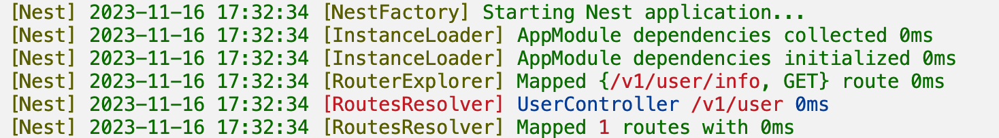
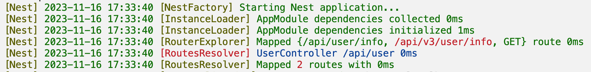
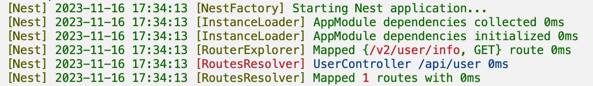
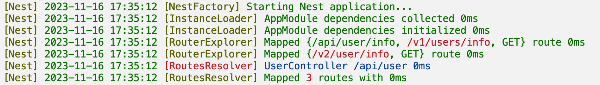

# 别名

有时候我们需要管理 API 的版本，`Nest`提供了一个『别名』的功能。

## Controller 别名

### 没有 prefix

比如有个`user.controller.ts`文件，添加一个`alias`参数：

```typescript
@Controller('user', {
  alias: '/v1/user/',
})
export class UserController {
  @Get('/info')
  info() {
    return 'info';
  }
}
```

这时你就有了两个 API：`/user/info` 和 `/v1/user/info`。每个方法都会多一个孪生兄弟。


### 有全局的 prefix

如果你设置了全局的 API 前缀：

```typescript
const app = await NestFactory.create(AppModule);
app.setGlobalPrefix('/api');
```

这时上例的 API 就变成了：`/api/user/info`和`/v1/user/info`。


如果你想你的别名也带全局的前缀（`/api/v1/user/info`），你可以在别名字符串中使用模板`${prefix}/`：

```typescript
@Controller("user", {
  alias: "${prefix}/v1/user/",
})
```


同理，你也可以使用模板字符串`${controller}`，下面的代码与之是等价的：

```typescript
@Controller("user", {
  alias: "${prefix}/v1/${controller}",
})
```

### 只使用别名

上面的情况会生成两套 API，但你可能会有这样的需求，只有这个`Controller`的 API 不以全局`prefix`开头，只有一套 API。这时你可以使用选项`isAliasOnly`：

```typescript
@Controller("/v1/user", {
  isAliasOnly: true,
})
```



它与下面的代码效果是一致的：

```typescript
@Controller("abcd", {
  alias: "/v1/user",
  isAliasOnly: true,
})
```

## 方法别名

```typescript
@Controller('/user')
export class UserController {
  @Get('/info', {
    alias: '/v1/user/info',
  })
  info() {}
}
```

这时，你会得到两个 API： `/user/info` 和`/v1/user/info`。


### 使用模板

上面的模板字符串`${prefix}`和`${controller}`在方法中同样工作，而且还多了一个方法名`${method}`：

```typescript
@Controller('/user')
export class UserController {
  @Get('/info', {
    alias: '${prefix}/v3/${controller}/${method}',
  })
  info() {}
}
```



### 只使用别名

`isAliasOnly` 同样工作：

```typescript
@Controller('/user')
export class UserController {
  @Get('/v2/user/info', {
    isAliasOnly: true,
  })
  info() {}
}
```



这时只会生成一个 API `/v2/user/info`，即使`Controller`也设置了别名：

```typescript
@Controller('/user', { alias: '/v1/users' })
export class UserController {
  @Get('/v2/user/info', {
    isAliasOnly: true,
  })
  info() {}
}
```

如果是下面的样例：

```typescript
@Controller('/user', { alias: '/v1/users' })
export class UserController {
  @Get('info')
  info() {}

  @Get('/v2/user/info', {
    isAliasOnly: true,
  })
  info2() {}
}
```

会有 3 个 API：



## 样例

关于别名的样例，参见[deno_nest/example/alias](https://github.com/jiawei397/deno-nest/tree/main/example/alias)。
