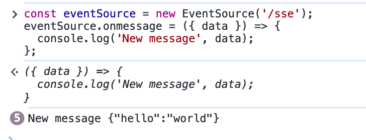
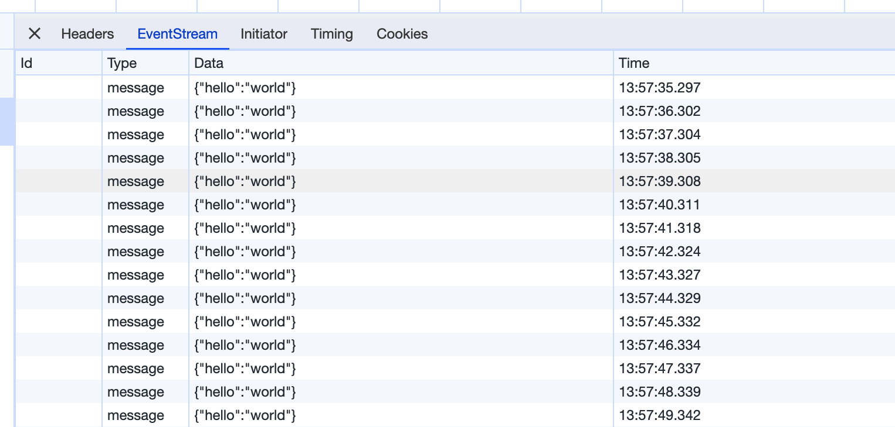
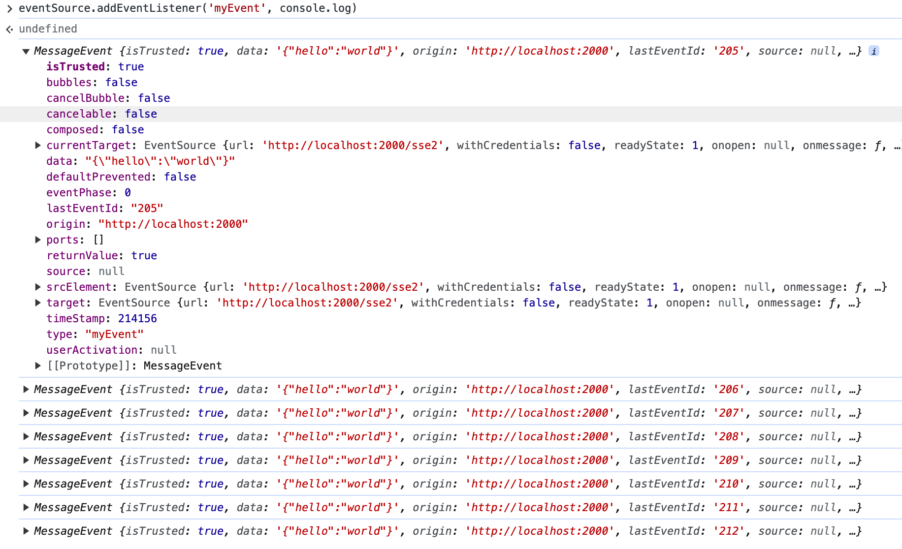
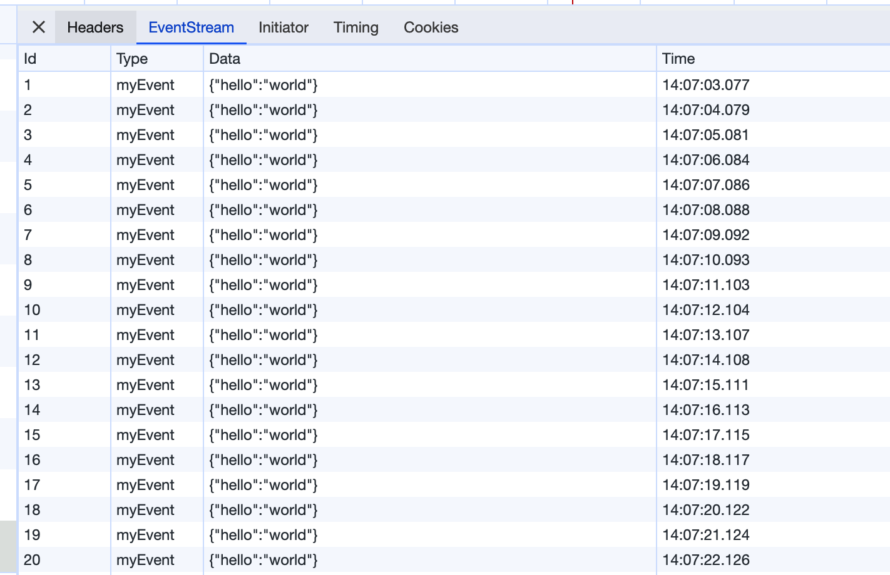
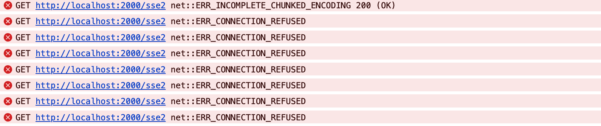
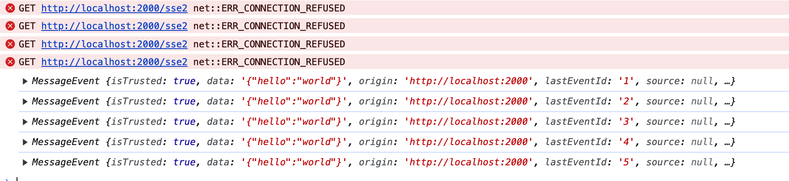

# Server-Sent Events

Server-Sent Events (SSE) is a server push technology that allows clients to receive automatic updates from the server over an HTTP connection. Each notification is sent in the form of text chunks, ending with a pair of newline characters (learn more [here](https://developer.mozilla.org/en-US/docs/Web/API/Server-sent_events)). Unlike WebSocket, SSE only allows the server to push data unidirectionally, and clients cannot send data; they can only unsubscribe.

## Usage

To enable Server-Sent Events on a route (registered in a controller class), use the `@Sse()` decorator and the `getSSEStream` handler. This handler needs to respond with a `ReadableStream`, as shown in the example below using the `body` parameter.

```typescript
import { Controller, Get, getSSEStream, Sse } from '@nest/core';

@Controller('')
export class AppController {
  @Get('/sse')
  @Sse()
  sse() {
    const { write, body } = getSSEStream({
      cancel() {
        clearInterval(st);
      },
    });

    const st = setInterval(() => {
      write({
        data: { hello: 'world' },
      });
    }, 1000);

    return body;
  }
}
```

:::warning
Note that SSE must be a `GET` request.

If there are cross-origin issues in the browser, it needs to be used in conjunction with the `CORS` middleware. See [here](./26_cors.en-US.md) for more details.
:::

With this setup, you can create an instance of the `EventSource` class in the client application, passing the `/sse` route as a constructor parameter. Test it in the browser console:

```javascript
const eventSource = new EventSource('/sse');
eventSource.onmessage = ({ data }) => {
  console.log('New message', data);
};
```

You should see continuous message logging:



In the network tab, there should be an `EventStream` section with specific messages:



The `EventSource` instance opens a persistent connection with the HTTP server, and the server sends events in the `text/event-stream` format. The connection remains open until `EventSource.close()` is called.


To stop receiving messages, simply execute the following in the console:

```javascript
eventSource.close();
```

This will trigger the `cancel` method in the code above.

## Parameters

In the `write` method's parameters, besides `data`, there are three additional fields:

```typescript
export interface SSEMessageEvent {
  data: string | object;
  id?: string | number;
  retry?: number;
  event?: string;
}
```

Here's an example:

```typescript
@Get("/sse2")
@Sse()
sseWithCustomEvent() {
  const { write, body } = getSSEStream({
    cancel() {
      clearInterval(st);
    },
  });

  let eventId = 1;
  const st = setInterval(() => {
    write({
      data: { hello: "world" },
      event: "myEvent",
      id: eventId++,
      retry: 5000,
    });
  }, 1000);

  return body;
}
```

If you use `onmessage` as in the original example to listen for events, you won't receive any information:

```typescript
const eventSource = new EventSource('/sse2');
eventSource.onmessage = ({ data }) => {
  console.log('New message', data);
};
```

You need to use `addEventListener` to listen for custom events:

```typescript
eventSource.addEventListener('myEvent', console.log);
```



In the network tab, you can see the added `id` and `event`:



What does the `retry` field mean? It tells the browser how long to wait before attempting to reconnect if the connection is lost, in milliseconds. If not set, the browser uses its default reconnection strategy.

You can stop the server and observe the corresponding prints in the browser console:



Once the server restarts successfully, there will be print messages again:



## Example

For sample code, refer to [here](https://github.com/jiawei397/deno-nest/tree/main/example/sse).
