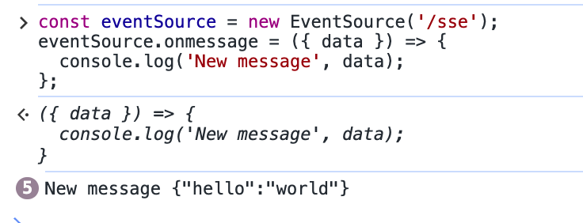
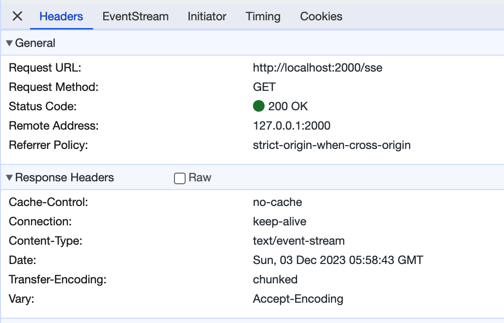
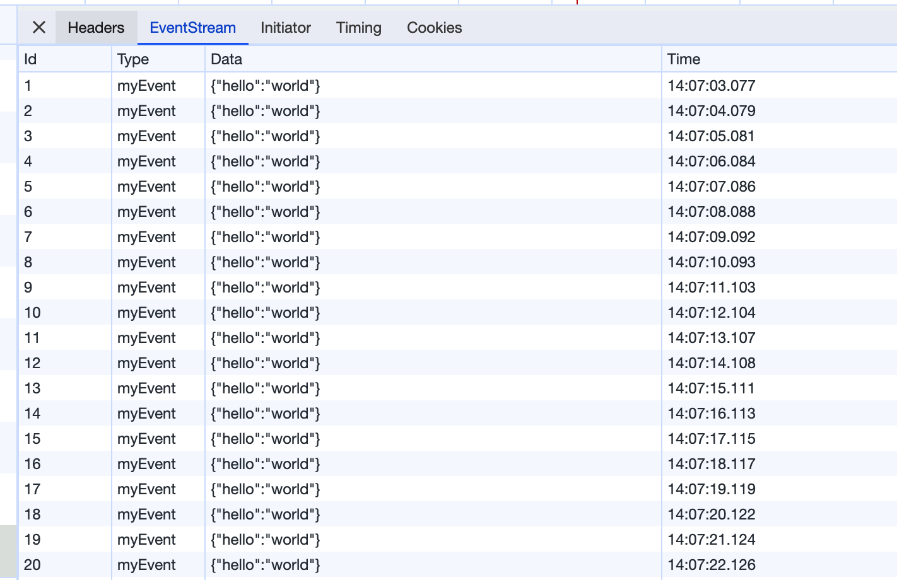

# 服务器发送事件

服务器发送事件（Server-Sent Events，SSE）是一种服务器推送技术，使客户端能够通过 HTTP 连接从服务器接收自动更新。每个通知都以文本块的形式发送，以一对换行结束（在[这里](https://developer.mozilla.org/en-US/docs/Web/API/Server-sent_events)了解更多信息）。它与 WebSocket 不同处在于，只能由服务器单向推送数据，客户端无法发送数据，只能取消。

## 用法

要在路由（在控制器类中注册的路由）上启用 Server-Sent 事件，请用`@Sse()`装饰器和`getSSEStream`处理程序，需要在方法中响应一个`ReadableStream`，在下例中为`body`。

```typescript
import { Controller, Get, getSSEStream, Sse } from '@nest/core';

@Controller('')
export class AppController {
  @Get('/sse')
  @Sse()
  sse() {
    const { write, body } = getSSEStream({
      cancel() {
        clearInterval(st);
      },
    });

    const st = setInterval(() => {
      write({
        data: { hello: 'world' },
      });
    }, 1000);

    return body;
  }
}
```

:::warning
需要注意的是，SSE 必须是`GET`。

如果浏览器中遇到跨域，需要结合`CORS`中间件一起使用，详见[这里](./26_cors.md)。
:::

有了这个设置，我们现在可以在客户端应用程序中创建一个 EventSource 类的实例，将`/sse`路由，作为构造函数参数传递进去。
我们在浏览器打开 F12 控制台进行测试：

```javascript
const eventSource = new EventSource('/sse');
eventSource.onmessage = ({ data }) => {
  console.log('New message', data);
};
```

能看到会不断打印消息：



在网络里也能看到有一栏`EventStream`，有具体的消息：


EventSource 实例打开一个与 HTTP 服务器的持久连接，服务器以`text/event-stream`格式发送事件。连接保持打开状态，直到调用`EventSource.close()`关闭。



如果要停止接收消息，只需要在控制台执行：

```javascript
eventSource.close();
```

这样就会触发上面代码中的`cancel`方法。

## 参数

`write`方法的参数中，除了 data 外，还包含其它三个字段：

```typescript
export interface SSEMessageEvent {
  data: string | object;
  id?: string | number;
  retry?: number;
  event?: string;
}
```

以下是个样例：

```typescript
@Get("/sse2")
@Sse()
sseWithCustomEvent() {
  const { write, body } = getSSEStream({
    cancel() {
      clearInterval(st);
    },
  });

  let eventId = 1;
  const st = setInterval(() => {
    write({
      data: { hello: "world" },
      event: "myEvent",
      id: eventId++,
      retry: 5000,
    });
  }, 1000);

  return body;
}
```

这时如果像原来样例一样使用`onmessage`来监听事件，就得不到任何信息了:

```typescript
const eventSource = new EventSource('/sse2');
eventSource.onmessage = ({ data }) => {
  console.log('New message', data);
};
```

需要使用`addEventListener`来监听自定义的事件：

```typescript
eventSource.addEventListener('myEvent', console.log);
```


在网络里也能看到添加的 id 和类型：



`retry`字段是什么意思呢？它告诉浏览器，如果连接断开了，需要隔多长时间再重新连接，单位是`ms`。如果不设置，则使用浏览器默认的重连策略。

读者可以停止服务，观察浏览器中请求，在控制台里有相应的打印：


一旦服务重启成功，就又有打印信息了：


## 样例

样例代码详见[这里](https://deno.land/x/deno_nest/example/sse/app.controller.ts?source)。
