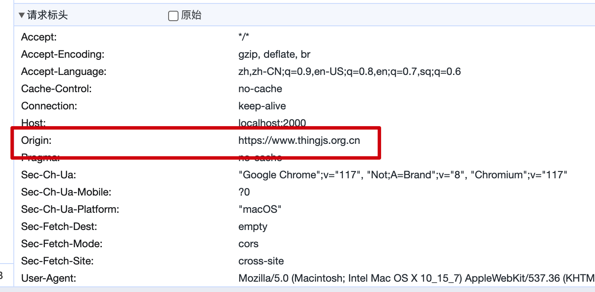
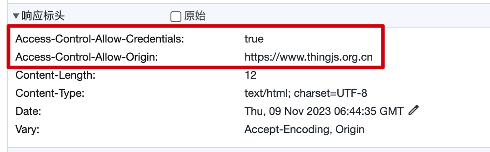

# CORS

跨域资源共享 (`CORS`) 是一种允许从另一个域请求资源的机制。在底层，Nest 提供了一个通用的`@nest/cors`包来帮助你进行自定义。

首先添加`importMap`：

```json
{
  "imports": {
    "@nest/core": "jsr:@nest/core@^0.0.2",
    "@nest/hono": "jsr:@nest/hono@^0.0.2",
    "@nest/cors": "jsr:@nest/cors@^0.0.2"
  }
}
```

开始使用：

```typescript
import { NestFactory } from '@nest/core';
import { Router } from '@nest/hono';
import { CORS } from '@nest/cors';
import { AppModule } from './app.module.ts';

const app = await NestFactory.create(AppModule, Router);
app.use(CORS());

await app.listen({
  port: 2000,
});
```

`CORS`方法采用可选的配置对象参数：

```typescript
export function CORS(options?: boolean | CorsOptions) {}

export interface CorsOptions {
  /**
   * 配置 `Access-Control-Allow-Origin` CORS 标头。
   */
  origin?: StaticOrigin | CustomOrigin;
  /**
   * 配置 Access-Control-Allow-Methods CORS 标头。
   */
  methods?: string | string[];
  /**
   * 配置 Access-Control-Allow-Headers CORS 标头。
   */
  allowedHeaders?: string | string[];
  /**
   * 配置 Access-Control-Expose-Headers CORS 标头。
   */
  exposedHeaders?: string | string[];
  /**
   * 配置 Access-Control-Allow-Credentials CORS 标头。
   */
  credentials?: boolean;
  /**
   * 配置 Access-Control-Max-Age CORS 标头。
   */
  maxAge?: number;
  /**
   * 是否将 CORS 预检请求的响应传递给下一个处理程序。
   */
  preflightContinue?: boolean;
  /**
   * 提供用于成功的 OPTIONS 请求的状态码。
   */
  optionsSuccessStatus?: number;
}
```

默认情况下，`CORS`中间件会读取请求中的`Origin`属性：


将它添加到响应标头中：


其它选项各有解释，并不复杂，这里就不赘述了。
