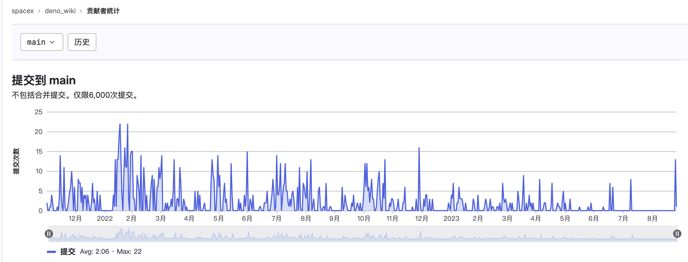

# Introduction

[NestJS](https://docs.nestjs.com/) is a framework for building efficient and scalable server-side applications with Node.js, and its power is widely recognized.

Internally, it defaults to using `Express`, the venerable Node.js HTTP server framework. Developers can leverage the extensive ecosystem of `Express`, and if performance is a concern, they have the option to configure the underlying framework to use `Fastify`.

Externally, NestJS provides an out-of-the-box application architecture, allowing developers and teams to create highly testable, scalable, loosely coupled, and maintainable applications. This architecture is deeply inspired by Angular.

If you are solely developing Web APIs, then NestJS with TypeScript support is an excellent choice.

However, NestJS currently does not support Deno and is unlikely to do so in the future. This is where the [deno_nest](https://deno.land/x/deno_nest) project comes in. Thanks to Deno's native first-class support for TypeScript, we can skip the TSC compilation step of NestJS, providing a better development experience.

:::warning
For the sake of convenience in this book, we will refer to `deno_nest` as simply `Nest`. Readers, please take note of the distinction from `NestJS`.
:::

## Underlying Engines: Oak and Hono

In terms of underlying engines, `deno_nest` currently supports two frameworks: [Oak](https://deno.land/x/oak@v12.6.1) and [Hono](https://hono.dev/).
The former is a framework developed by Deno's official developers. As its name suggests, it is based on the classic Node.js framework [Koa](https://koa.bootcss.com/) (which is now supported by Deno). Interested readers can refer to my previous article "[From Koa to Oak](../blog/01_koa_oak)." Unfortunately, its core developer has left the Deno company, and maintenance has been challenging in the past year.

As for Hono, the term means "flame" in Japanese (indicating the developer may be a friend from Japan). It is a small, simple, and extremely fast Edges Web framework. It is suitable for any JavaScript runtime: Cloudflare Workers, Fastly Compute@Edge, Deno, Bun, Vercel, Netlify, Lagon, AWS Lambda, Lambda@Edge, and Node.js.

Its core selling point is speed. The following is a performance comparison of several frameworks under Deno, as listed by the Hono official website: [Deno Frameworks Performance Comparison](https://hono.dev/concepts/benchmarks#deno):

| **Framework** | **Version** | **Results** |
|:---:|:---:|:---:|
| **Hono** | 3.0.0 | **Requests/sec: 136112** |
| Fast | 4.0.0-beta.1 | Requests/sec: 103214 |
| Megalo | 0.3.0 | Requests/sec: 64597 |
| Faster | 5.7 | Requests/sec: 54801 |
| oak | 10.5.1 | Requests/sec: 43326 |
| opine | 2.2.0 | Requests/sec: 30700 |

In the same testing benchmarks, Hono does indeed outperform Oak by a significant margin.

Currently, Hono has garnered 7.8K GitHub stars:

While the well-established Oak has 4.9K GitHub stars:

The above factors are what prompted me to switch the underlying engine of `deno_nest` from Oak to Hono.

## Unit Test Coverage

The predecessor of `deno_nest` is [oak_nest](https://deno.land/x/oak_nest), which is the same project on GitHub, but no new content will be published under this package in the future.

It was initially developed in June 2021 and was first used in our team's blog project named "wiki" at the end of that year. After the New Year, the underlying structure seamlessly migrated from NestJS, and due to my implementation of the majority of the APIs used in the original project, the migration was relatively smooth. Currently, the service has been running stably (using K8S+Docker) for a year and a half:

Switching the engine itself is relatively easy because the framework's use of engine capabilities mainly involves routing and middleware. This accounts for a relatively small part of the entire framework. More significant are the split and integration of different levels in the upper layers.

However, I chose to support two engines simultaneously to leave room for a potential third engine in the future. After all, who can guarantee that a framework with better performance than Hono won't emerge in the future?

Supporting two engines requires a lot of work, and I had to add a significant number of unit tests to ensure code stability.

Currently (as of November 20, 2023), the [test coverage](https://app.codecov.io/gh/jiawei397/deno-oak-nest) has reached 98.68%, covering most code branches. Further improvements will be made in the future:

## Differences in Capabilities Compared to NestJS

NestJS is a powerful framework, and `Nest` (the `deno_nest` project) has implemented the core capabilities for the web side. However, it currently lacks support for more advanced features such as complex microservices, WebSockets, GraphQL, etc. There are no immediate plans to support these features.

:::info
The majority of the content in this document is referenced from the [NestJS official documentation](https://docs.nestjs.com/).
:::
