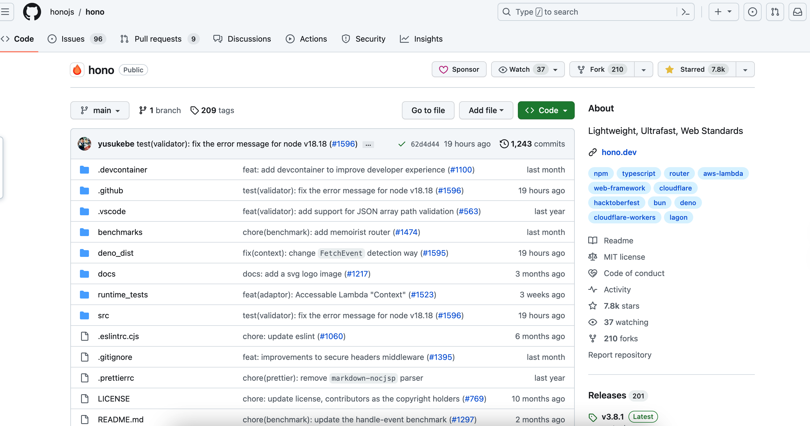
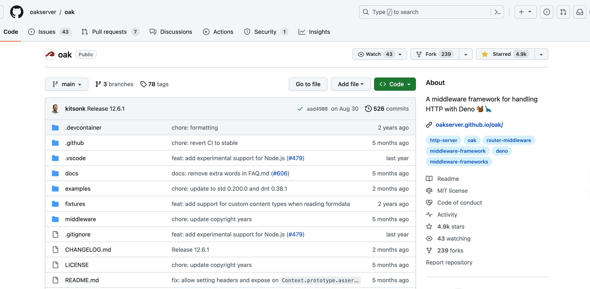
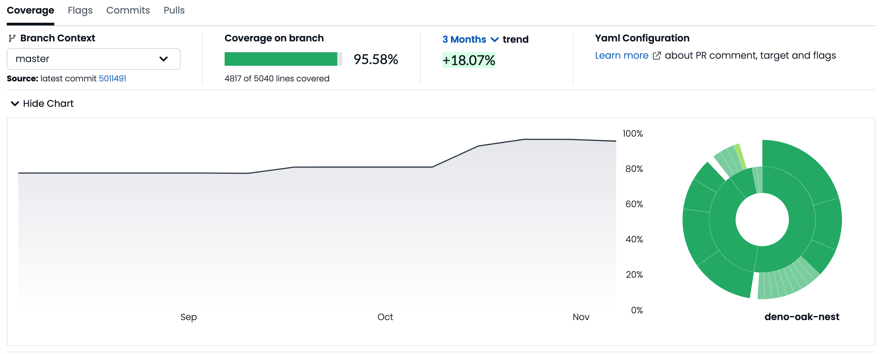
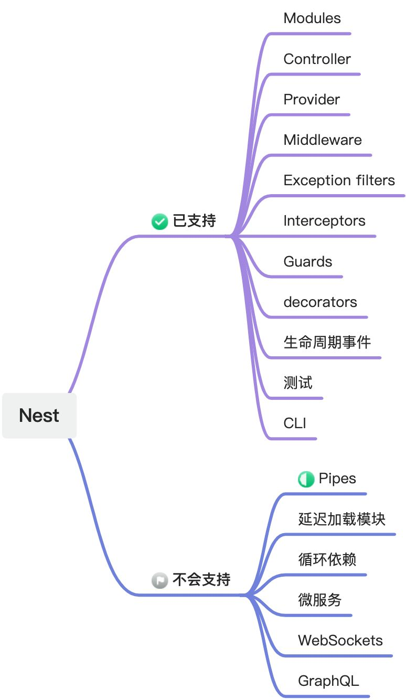

# 介绍

[NestJS](https://docs.nestjs.com/)是一个用于构建高效、可扩展的Node.js服务器端应用程序的框架，它的强大是有目共睹。

在内部，它默认使用`Express`这个古老的Node.js的HTTP服务器框架，开发者可以复用`Express`庞大的生态系统，而如果需要兼顾性能，又可以选择将底层配置为使用`Fastify`。

在外部，NestJS提供了一个开箱即用的应用程序架构，允许开发人员和团队创建高度可测试、可扩展、松散耦合且易于维护的应用程序。该架构深受 Angular 的启发。

如果单纯地进行Web API的开发，那么支持TypeScript的NestJS是你的不二之选。

但NestJS尚不支持Deno，且应该不会支持。所以才有了[deno_nest](https://deno.land/x/deno_nest)这个项目。得益于Deno原生对TypeScript的一流支持，所以我们可以省去NestJS的TSC编译步骤，开发体验会更好些。

:::warning{title=注意}
为行文方便，本书中将`deno_nest`命名为`Nest`，读者请注意与`NestJS`的区别。
:::

## 底层引擎：oak与hono

底层引擎方面，`deno_nest`目前支持两种框架，一个是[oak](https://deno.land/x/oak@v12.6.1)，一个是[hono]()。
前者是Deno官方开发者开发的一款框架，从命名上可知它是参考了Node.js的经典框架[koa](https://koa.bootcss.com/)（目前已经被Deno支持），有兴趣的读者可以参看我之前的文章《[从koa到oak](../blog/01_koa_oak)》。遗憾的是其核心开发者已经离开了Deno公司，近一年来维护上已经捉襟见肘。

而hono在日语中是火焰的意思（所以开发者应该是日本友人），是一个小型、简单且超快的 Edges Web 框架。它适用于任何 JavaScript 运行时：Cloudflare Workers、Fastly Compute@Edge、Deno、Bun、Vercel、Netlify、Lagon、AWS Lambda、Lambda@Edge 和 Node.js。

它的核心卖点是快，以上是Hono官方罗列的[Deno下的几款框架性能对比](https://hono.dev/concepts/benchmarks#deno)：

| **Framework** | **Version** | **Results** |
|:---:|:---:|:---:|
| **Hono** | 3.0.0 | **Requests/sec: 136112** |
| Fast | 4.0.0-beta.1 | Requests/sec: 103214 |
| Megalo | 0.3.0 | Requests/sec: 64597 |
| Faster | 5.7 | Requests/sec: 54801 |
| oak | 10.5.1 | Requests/sec: 43326 |
| opine | 2.2.0 | Requests/sec: 30700 |

在相同的测试基准下，hono确实要比oak好许多。

目前hono的GitHub star已经有7.8K：

而老牌的oak则是4.9K：

以上都是促使我将`deno_nest`的底层从oak切换到hono的原因。

## 单元测试覆盖率

`deno_nest`的前身是[oak_nest](https://deno.land/x/oak_nest)，在GitHub上是同一个工程，但后续不会再往这个包下发布新的内容。

它初始开发于2021年6月，当年年底始用于我们团队一个名为wiki的博客类项目，在年后将底层从NestJS无缝迁移过来，由于我实现了绝大多数原工程用过的API，所以迁移难度并不大，目前服务已经稳定运行（使用K8S+Docker）了一年半的时间：

切换引擎本身很容易，因为框架用到引擎的能力无非就是路由与中间件，这个在整个框架中占比是较小的一部分，更多的是更上层不同层级的拆分与整合。

只不过，我选择同时支持两套引擎，为将来可能再有的第三个引擎留个缺口，谁也无法保障未来不会出现比hono性能更好的框架不是？

同时支持两套引擎需要做大量的工作，我不得不添加了大量的单元测试以保障代码的稳定性。

目前（2023年11月12日）[测试覆盖率](https://app.codecov.io/gh/jiawei397/deno-oak-nest)已经达到95.58%，大多数代码分支已经覆盖到，未来还会进一步完善：

## 与NestJS的能力差异

NestJS的功能是非常强大的，Nest只实现了其核心的Web端的核心能力，至于更复杂的微服务、WebSockets、GraphQL等，暂时没有支持的计划。

:::info
本文档大部分内容参考[NestJS官方文档](https://docs.nestjs.com/)。
:::
